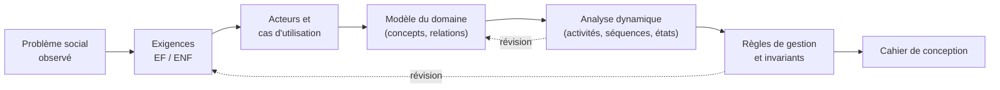
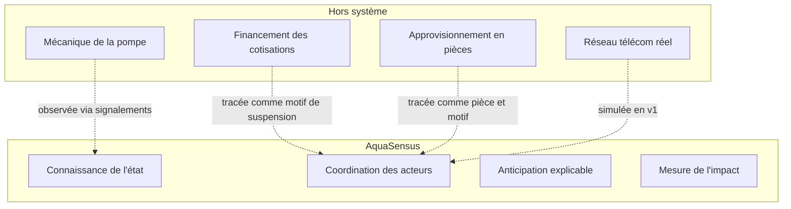

# AquaSensus — Cahier d'analyse

**Du besoin social au modèle métier**

| Métadonnée | Valeur |
| --- | --- |
| Référence | AQS-ANA-001 |
| Version | 1.1 |
| Statut | Validé — entrée du cahier de conception |
| Nature | Analyse orientée objet (UML), indépendante des technologies |
| Document maître | `docs/CONTEXTE-AQUASENSUS.md` (bible) |
| Entrée | `docs/CAHIER-DES-CHARGES.md` (AQS-CDC-001) |
| Sortie | `docs/CAHIER-CONCEPTION.md` (AQS-CNC-001) |
| Modélisation | `docs/diagrammes/` (AQS-UML-001) |

### Historique des révisions

| Version | Date | Nature |
| --- | --- | --- |
| 1.0 | 2026-08-26 | Création : acteurs, cas d'utilisation, modèle du domaine, dynamique, règles, matrices de traçabilité |
| 1.1 | 2026-08-26 | Alignement sur H-2 : aucun relevé de volume ; UC-7, dictionnaire, indicateurs et traçabilité basculés sur la charge d'usage estimée |

---

## Position de ce document

Trois documents se répondent, avec une frontière stricte :

| Document | Question à laquelle il répond | Ce qu'il s'interdit |
| --- | --- | --- |
| Cahier des charges | **Quoi ?** Quelles exigences, quels critères d'acceptation | Décrire des classes ou des couches |
| **Cahier d'analyse (ce document)** | **Quoi, structuré ?** Quels objets métier, quels comportements, quelles règles | Nommer une technologie, un framework, une table |
| Cahier de conception | **Comment ?** Quelles couches, quels composants, quel schéma, quelles API | Réinventer une règle métier |

**Règle de discipline :** aucun mot de la stack (Java, Spring, PostgreSQL, Angular, Flutter, Python, Docker, JPA, REST) n'apparaît dans l'analyse autrement que pour être explicitement renvoyé à la conception. L'analyse doit rester valable si la stack change.

---

## Sommaire

1. [Démarche d'analyse](#1-démarche-danalyse)
2. [Analyse du domaine social](#2-analyse-du-domaine-social)
3. [Acteurs et rôles](#3-acteurs-et-rôles)
4. [Modèle des cas d'utilisation](#4-modèle-des-cas-dutilisation)
5. [Descriptions textuelles des cas d'utilisation majeurs](#5-descriptions-textuelles-des-cas-dutilisation-majeurs)
6. [Modèle du domaine](#6-modèle-du-domaine)
7. [Dictionnaire des concepts métier](#7-dictionnaire-des-concepts-métier)
8. [Analyse dynamique](#8-analyse-dynamique)
9. [Machines à états](#9-machines-à-états)
10. [Règles de gestion et invariants](#10-règles-de-gestion-et-invariants)
11. [Analyse du raisonnement prédictif](#11-analyse-du-raisonnement-prédictif)
12. [Analyse des contraintes de terrain](#12-analyse-des-contraintes-de-terrain)
13. [Matrices de traçabilité](#13-matrices-de-traçabilité)
14. [Points ouverts et décisions à prendre](#14-points-ouverts-et-décisions-à-prendre)

---

## 1. Démarche d'analyse

### 1.1 Enchaînement

### 1.2 Principes retenus

| Principe | Conséquence sur l'analyse |
| --- | --- |
| Le domaine se dit dans la langue du comité | Les classes s'appellent `PointEau`, `Signalement`, `Comité`, jamais `Asset`, `Ticket`, `Node` |
| Ce qui n'est pas mesuré n'existe pas | Tout concept doit servir un KPI, une décision ou une preuve |
| L'humain est le capteur | Le modèle est conçu pour des données déclarées, imprécises, parfois absentes |
| L'incertitude se modélise, elle ne se cache pas | La confiance, l'imputation, l'aberration sont des attributs de première classe |
| Une règle métier vit dans le domaine | Aucune règle ne doit être portée par une interface ou une couche technique |

### 1.3 Sources

Cette analyse dérive du cahier des charges AQS-CDC-001 (exigences `EF-nn`, règles `RG-nn`, KPI `KPI-nn`). Toute divergence constatée est un défaut : le cahier des charges prévaut, et l'analyse est corrigée.

---

## 2. Analyse du domaine social

### 2.1 Le problème reformulé en termes d'information

La panne d'un forage communautaire n'est pas d'abord un problème mécanique : c'est un **problème d'information et de coordination**.

| Ce qui manque aujourd'hui | Conséquence | Concept d'analyse qui y répond |
| --- | --- | --- |
| Personne ne sait que l'ouvrage faiblit | Aucune anticipation | `Signalement` de signal faible, `IndiceSanté` |
| Personne ne sait qui est prévenu | Chacun croit qu'un autre a agi | `Corroboration`, état de prise en charge |
| Le technicien ignore l'histoire de l'ouvrage | Déplacement à l'aveugle, pièce manquante | `HistoriqueÉtat`, `DossierPréparation` |
| Nul ne sait combien de temps dure la privation | Aucun arbitrage possible, aucune redevabilité | `TempsRétablissement` |
| Nul ne sait si l'argent collecté a servi | Défiance envers le comité | `Intervention` avec pièces et coûts |

### 2.2 Ce que le système doit rendre possible

1. **Rendre visible** l'état réel de chaque ouvrage, à tout instant, pour tous.
2. **Agréger** des observations individuelles faibles en un signal collectif fort (corroboration).
3. **Anticiper** la défaillance à partir de l'usage et de l'histoire, avec une explication compréhensible.
4. **Coordonner** comité, technicien et habitants autour d'un état partagé.
5. **Mesurer** le temps de privation d'eau, seule preuve d'amélioration réelle.

### 2.3 Frontière du système

Le système **n'agit pas** sur la mécanique, l'argent ou la logistique. Il agit sur ce qui les précède : savoir, décider, se coordonner, prouver.

---

## 3. Acteurs et rôles

### 3.1 Classification

| Acteur | Nature | Intention principale | Fréquence d'usage |
| --- | --- | --- | --- |
| Habitant / usager | Principal, humain | Signaler vite, savoir si c'est pris en charge | Épisodique, sous stress |
| Délégué / comité | Principal, humain | Décider quoi réparer, avec quels moyens, dans quel ordre | Quotidienne à hebdomadaire |
| Technicien | Principal, humain | Arriver en sachant, réparer, prouver | Par intervention |
| Partenaire (ONG, mairie) | Principal, humain | Piloter, arbitrer, rendre compte à un bailleur | Mensuelle |
| Administrateur | Secondaire, humain | Tenir le référentiel et les paramètres | Rare |
| Moteur prédictif | Secondaire, système | Produire indices et alertes | Quotidienne, automatique |
| Canal SMS/USSD | Secondaire, système | Porter le signalement sans smartphone | Continue |

### 3.2 Caractérisation d'usage

L'analyse retient trois profils d'usage qui contraignent tout le reste :

| Profil | Contrainte structurante | Impact sur le modèle |
| --- | --- | --- |
| Habitant | Peut ne pas avoir de compte, ni de smartphone, ni de réseau | Le `Signalement` doit exister sans `Utilisateur` : le déclarant est un objet valeur, pas une clé étrangère obligatoire |
| Technicien | Travaille hors ligne, en déplacement | Toute création métier porte un identifiant d'origine client, indépendant du serveur |
| Délégué | Bénévole, temps limité, décide sous contrainte de moyens | Le système propose une file **priorisée**, jamais une liste brute |

### 3.3 Rôles et périmètres

Le contrôle d'accès combine deux dimensions, ce qui est un choix d'analyse et non une commodité technique :

- **Rôle** : ce que l'acteur a le droit de faire (qualifier, affecter, clôturer).
- **Périmètre** : sur quels ouvrages il a le droit de le faire (son comité, sa localité).

Un délégué du quartier A ne doit pas pouvoir qualifier un signalement du quartier B, même s'il en a le rôle. Cette séparation évite un modèle de permissions plat qui deviendrait ingérable dès la deuxième commune.

**Diagramme :** `docs/diagrammes/02-classes/CL1-identite-rbac.puml`

---

## 4. Modèle des cas d'utilisation

### 4.1 Vue globale

Onze cas d'utilisation couvrent l'intégralité du périmètre v1.

**Diagramme :** `docs/diagrammes/00-global/G1-cas-utilisation-global.puml`

| Cas | Intitulé | Acteur principal | Déclencheur |
| --- | --- | --- | --- |
| UC-1 | Consulter l'état d'un point d'eau | Habitant | Besoin d'eau, doute sur la disponibilité |
| UC-2 | Signaler un dysfonctionnement | Habitant | Constat sur place |
| UC-3 | Qualifier un signalement | Délégué | Arrivée d'un signalement |
| UC-4 | Planifier et affecter une intervention | Délégué | Signalement qualifié ou alerte acquittée |
| UC-5 | Réaliser l'intervention et consigner le diagnostic | Technicien | Affectation reçue |
| UC-6 | Confirmer le rétablissement | Délégué | Intervention déclarée réalisée |
| UC-7 | Estimer la charge d'usage et l'échéance d'entretien | Moteur prédictif | Traitement quotidien (aucune saisie humaine) |
| UC-8 | Émettre les alertes prédictives | Moteur prédictif | Traitement quotidien |
| UC-9 | Traiter une alerte prédictive | Délégué | Réception d'une alerte |
| UC-10 | Suivre les KPI et exporter | Partenaire | Reporting périodique |
| UC-11 | Gérer référentiel, comptes et seuils | Administrateur | Évolution du parc ou du paramétrage |

### 4.2 Déclinaison par module

Chaque module fait l'objet d'un diagramme détaillé montrant inclusions et extensions.

| Diagramme | Module | Ce qu'il apporte par rapport à la vue globale |
| --- | --- | --- |
| `UC1-referentiel.puml` | M1 | La création d'un ouvrage inclut nécessairement son rattachement à une localité et l'historisation de son état initial |
| `UC2-signalement.puml` | M2 | Le signalement sans compte est une **extension** du signalement, pas un cas séparé ; la détection de doublon est une **inclusion** systématique |
| `UC3-maintenance.puml` | M3 | La confirmation de rétablissement inclut le calcul du délai : on ne peut pas clôturer sans mesurer |
| `UC4-charge-saisonnalite.puml` | M4 | La charge d'usage n'est **pas saisie** : elle est déduite du référentiel et du calendrier, et exprimée en jours pondérés, jamais en litres |
| `UC5-prediction-alertes.puml` | M5 | L'émission d'alerte inclut l'explication : une alerte sans explication n'est pas émise |
| `UC6-pilotage-kpi.puml` | M6 | La carte et la file de travail partagent le même filtrage |
| `UC7-canal-sms-ussd.puml` | M7 | L'adaptateur de messagerie est le point de variation ; l'opérateur réel est un acteur externe post-v1 |
| `UC8-administration-identite.puml` | M9, M10 | Toute opération d'administration inclut sa journalisation |

### 4.3 Ce qui n'est volontairement pas un cas d'utilisation

| Écarté | Raison |
| --- | --- |
| « Saisir un relevé de volume » | Hors périmètre (H-2) : les habitants puisent librement ; à la fin d'une journée, le volume consommé est inconnaissable. Toute saisie (bidons, seaux, minutes de pompage) serait fictive. |
| « Payer une cotisation » | Hors périmètre (§2.2 du cahier des charges), et hors fibre du projet |
| « Commander une pièce » | Relève de la logistique du comité ; le système trace le motif de suspension, il ne gère pas l'approvisionnement |
| « Diagnostiquer automatiquement la panne » | Le diagnostic reste humain ; le système fournit le contexte, il ne remplace pas le technicien |
| « Noter un technicien » | Introduirait une logique de surveillance des personnes, contraire au principe de dignité |

---

## 5. Descriptions textuelles des cas d'utilisation majeurs

### UC-2 — Signaler un dysfonctionnement

| Rubrique | Contenu |
| --- | --- |
| **Acteur principal** | Habitant (avec ou sans compte) |
| **Acteurs secondaires** | Délégué (notifié), canal SMS/USSD |
| **Objectif** | Faire connaître un dysfonctionnement en moins de 60 secondes |
| **Préconditions** | Le point d'eau existe au référentiel ; le déclarant connaît son code, son nom ou sa position |
| **Postconditions** | Un incident existe ou est corroboré ; le déclarant connaît l'état de prise en charge |
| **Exigences** | EF-10 à EF-17 |

**Scénario nominal**

1. Le déclarant ouvre l'application ou compose le code USSD.
2. Il sélectionne le point d'eau (carte, liste, code court, ou saisie du code).
3. Il choisit une catégorie de symptôme dans une liste fermée.
4. Il indique la gravité perçue.
5. Il valide (commentaire et photo restent facultatifs).
6. Le système recherche un signalement corroborable sur le même ouvrage et la même catégorie dans la fenêtre de corroboration.
7. Le système enregistre l'incident ou incrémente la corroboration, calcule la priorité, et notifie le comité si la gravité est haute.
8. Le système affiche l'état de prise en charge.

**Scénarios alternatifs**

| Id | Condition | Comportement |
| --- | --- | --- |
| A1 | Réseau indisponible | Le signalement est mis en file locale, marqué « à envoyer », puis transmis automatiquement. Le déclarant reçoit une confirmation locale immédiate. |
| A2 | Signalement identique existant | Corroboration : le compteur augmente, aucun nouvel incident n'est créé. |
| A3 | Déclarant sans compte | Identification légère par numéro de téléphone et code de vérification. |
| A4 | Quota public dépassé | Le signalement est refusé avec une explication de la limite. |
| A5 | Panne totale confirmée | L'ouvrage bascule en indisponibilité et le changement d'état est historisé. |
| A6 | Rejeu du même envoi | La réponse initiale est renvoyée, sans nouvelle création. |

**Diagrammes :** `AC1-signaler-incident.puml`, `SQ2-signalement-pwa.puml`, `SQ3-signalement-sms.puml`, `SQ4-session-ussd.puml`

---

### UC-6 — Confirmer le rétablissement

| Rubrique | Contenu |
| --- | --- |
| **Acteur principal** | Délégué |
| **Acteur secondaire** | Habitants déclarants (notifiés) |
| **Objectif** | Attester que l'eau coule à nouveau, et figer la mesure du KPI social |
| **Préconditions** | Une intervention est déclarée réalisée, avec un compte rendu complet |
| **Postconditions** | L'intervention est close, le délai est calculé, l'ouvrage est disponible, les signalements sont résolus |
| **Exigences** | EF-24, EF-25 ; règles RG-04, RG-05 |

**Scénario nominal**

1. Le délégué constate sur place que l'eau est rétablie.
2. Il confirme le rétablissement.
3. Le système vérifie que le confirmateur est distinct du technicien déclarant.
4. Le système vérifie que le compte rendu est complet.
5. Le système calcule le temps de rétablissement depuis le **premier signalement rattaché**.
6. L'ouvrage redevient disponible, les signalements rattachés passent à résolu, l'indice est recalculé.
7. Les déclarants sont notifiés avec la durée d'interruption.

**Scénarios alternatifs**

| Id | Condition | Comportement |
| --- | --- | --- |
| B1 | Le confirmateur est le technicien déclarant | Refus : la clôture exige un tiers. |
| B2 | Compte rendu incomplet | Refus, avec indication du champ manquant. |
| B3 | Eau non rétablie | L'intervention repasse en cours ; aucun délai n'est figé. |
| B4 | Récidive sous 15 jours | Une nouvelle intervention est ouverte avec lien de filiation. |

**Pourquoi cette exigence de tiers ?** Sans elle, le délai mesuré serait un délai déclaré par celui-là même qu'il évalue. Le KPI perdrait toute valeur de preuve devant une assemblée de quartier ou un bailleur.

**Diagrammes :** `AC3-cycle-intervention.puml`, `SQ7-cloture-et-kpi.puml`, `ET3-intervention.puml`

---

### UC-9 — Traiter une alerte prédictive

| Rubrique | Contenu |
| --- | --- |
| **Acteur principal** | Délégué |
| **Acteur secondaire** | Moteur prédictif |
| **Objectif** | Transformer une prédiction en décision, ou la contester |
| **Préconditions** | Une alerte active existe sur un ouvrage du périmètre |
| **Postconditions** | L'alerte a une issue traçable ; le moteur peut être évalué |
| **Exigences** | EF-42 à EF-46 ; règles RG-06, RG-07 |

**Scénario nominal**

1. Le délégué reçoit la notification d'alerte.
2. Il consulte l'explication et les trois facteurs contributifs majeurs.
3. Il accuse réception.
4. Il crée une intervention préventive depuis l'alerte.
5. L'intervention se déroule et est clôturée avant l'échéance de l'horizon.
6. L'alerte est marquée traitée, avec l'issue « panne évitée ».

**Scénarios alternatifs**

| Id | Condition | Comportement |
| --- | --- | --- |
| C1 | Moyens indisponibles | Report avec échéance et motif ; relance programmée. |
| C2 | Diagnostic jugé faux | Contestation motivée ; le motif est conservé pour ajuster les seuils, les relances cessent. |
| C3 | Conditions disparues | L'alerte devient caduque automatiquement. |
| C4 | Panne survenue malgré tout | Issue « panne survenue » : l'anticipation a fonctionné, l'action a manqué. |

**Point d'analyse majeur.** Une alerte contestée n'est pas un échec du système, c'est une **donnée d'apprentissage**. Le modèle conserve donc le motif de contestation comme information de première classe, au même titre que l'alerte elle-même.

**Diagrammes :** `AC5-traiter-alerte.puml`, `ET4-alerte.puml`

---

## 6. Modèle du domaine

### 6.1 Vue globale

**Diagramme :** `docs/diagrammes/00-global/G2-classes-domaine-global.puml`

### 6.2 Découpage en domaines

L'analyse identifie sept domaines cohérents, chacun avec une responsabilité unique et un vocabulaire propre.

| Domaine | Responsabilité | Concept pivot | Diagramme |
| --- | --- | --- | --- |
| Identité | Qui agit, avec quel droit, sur quel périmètre | `Utilisateur` | `CL1-identite-rbac.puml` |
| Référentiel | Ce qui est suivi et où | `PointEau` | `CL2-referentiel.puml` |
| Signalement | Ce qui est observé par les humains | `Signalement` | `CL3-signalement.puml` |
| Maintenance | Ce qui est fait pour rétablir | `Intervention` | `CL4-maintenance.puml` |
| Charge | Combien l'ouvrage a servi, **estimé sans jamais le mesurer** | `ChargeUsage` | `CL5-charge-usage.puml` |
| Prédiction | Ce qu'on en déduit | `IndiceSanté`, `Alerte` | `CL6-prediction.puml` |
| Messagerie | Comment on atteint les gens | `MessagingGateway` | `CL7-messagerie-simulee.puml` |

Le domaine `Charge` mérite une explication, car il est né d'un renoncement. L'intuition première était de mesurer les volumes tirés. Le terrain l'interdit : les habitants puisent librement et personne, en fin de journée, ne peut dire combien d'eau est sortie de l'ouvrage. Un domaine bâti sur cette mesure aurait produit des écrans que personne ne remplit et des indicateurs toujours vides. Le domaine a donc été retourné : il ne collecte rien et déduit tout de ce qui est déjà connu, à savoir la population desservie, le temps écoulé depuis le dernier entretien et la saison en cours.

**Critère de découpage retenu :** deux concepts appartiennent au même domaine s'ils changent pour la même raison métier. L'`Intervention` et le `Signalement` sont séparés parce qu'un signalement décrit une **observation** (subjective, corroborable) alors qu'une intervention décrit une **action** (planifiée, tracée, coûteuse).

### 6.3 Agrégats et invariants

L'analyse retient cinq agrégats, chacun garantissant ses propres invariants.

| Agrégat | Racine | Contenu | Invariant garanti |
| --- | --- | --- | --- |
| Ouvrage | `PointEau` | Historique d'état, coordonnées, pièces jointes | L'état courant est toujours cohérent avec le dernier historique |
| Incident | `Signalement` | Déclarant, corroborations | Un signalement rejeté n'influence jamais l'état ni l'indice |
| Intervention | `Intervention` | Compte rendu, jalons, pièces, durée | Aucune clôture sans confirmateur tiers et compte rendu complet |
| Calendrier saisonnier | `CalendrierSaisonnier` | Périodes saisonnières et coefficients | Les périodes d'une même localité ne se chevauchent jamais |
| Évaluation | `IndiceSanté`, `Alerte` | Facteurs, paramétrage figé | Une alerte reste interprétable avec les seuils de son époque |

La charge d'usage n'est pas un agrégat : c'est un **objet valeur recalculé** à chaque évaluation. Rien ne justifierait de la persister comme entité vivante, puisqu'elle ne résulte d'aucune saisie et se recalcule intégralement à partir du référentiel et du calendrier.

### 6.4 Objets valeur significatifs

Ces concepts ne sont pas de simples champs : ils portent une règle.

| Objet valeur | Ce qu'il protège |
| --- | --- |
| `Téléphone` | Le numéro n'existe jamais en clair : empreinte plus quatre derniers chiffres. La protection de la vie privée est structurelle, pas ajoutée après coup. |
| `Périmètre` | Empêche qu'un droit d'agir devienne un droit d'agir partout. |
| `Coordonnées` | Valide l'appartenance à l'emprise géographique et calcule les distances. |
| `DuréeRétablissement` | Encapsule la seule définition légitime du KPI : de la première alerte humaine à la confirmation par un tiers. |
| `ChargeUsage` | Exprime l'usure en jours pondérés et refuse l'unité de volume, pour qu'aucune interface ne laisse croire à une mesure qui n'existe pas. |
| `Facteur` | Rend une contribution explicable : valeur observée, seuil, poids. |
| `DossierPréparation` | Matérialise la fin du déplacement à l'aveugle. |

### 6.5 Concepts refusés

| Concept écarté | Pourquoi |
| --- | --- |
| `Ticket` générique | Aurait fusionné observation et action, deux cycles de vie et deux responsabilités différentes |
| `Capteur` | Aucun capteur en v1 ; un futur débitmètre serait un **nouveau domaine**, pas une colonne ajoutée en silence |
| `RelevéVolume` | Le volume consommé est inconnaissable (H-2). Le concept a été écarté pour ne pas produire d'écrans que personne ne remplit |
| `Facture` | Le coût est un attribut d'intervention, pas un objet financier autonome ; introduire une facture appellerait un paiement, hors périmètre |
| `Score` nu | Un score sans facteurs explicatifs serait inutilisable par un comité |

---

## 7. Dictionnaire des concepts métier

| Concept | Définition d'analyse | Attributs déterminants | Cycle de vie |
| --- | --- | --- | --- |
| **Point d'eau** | Ouvrage hydraulique communautaire suivi individuellement | code, type, position, population desservie, intervalle de maintenance optionnel, état | `ET1-point-eau.puml` |
| **Localité** | Découpage territorial hiérarchique | code, niveau, parent | Stable |
| **Comité** | Collectif responsable d'un ou plusieurs ouvrages | nom, contact, délégués | Stable |
| **Utilisateur** | Personne agissant dans le système | identifiant, rôles, périmètre, statut | Actif, suspendu, verrouillé |
| **Signalement** | Observation humaine d'un dysfonctionnement | catégorie, gravité, canal, corroborations, priorité | `ET2-signalement.puml` |
| **Corroboration** | Rattachement d'une observation identique à un incident existant | fenêtre temporelle, compteur | Attribut de signalement |
| **Intervention** | Action de maintenance jusqu'au rétablissement constaté | type, origine, statut, jalons, compte rendu, durée | `ET3-intervention.puml` |
| **Compte rendu** | Trace technique de ce qui a été diagnostiqué et fait | diagnostic, cause racine, actions | Complet ou incomplet |
| **Charge d'usage** | Estimation de l'usure subie par l'ouvrage depuis sa dernière maintenance, **sans aucune mesure de volume** | charge cumulée en jours pondérés, intervalle effectif, date de référence, saison | Recalculée à chaque évaluation |
| **Calendrier saisonnier** | Périodes de l'année et coefficients qui pondèrent la charge | localité, coefficients, dates | Paramétré une fois, rarement modifié |
| **Indice de santé** | Synthèse quotidienne de l'état d'usure d'un ouvrage | score, bande, confiance, facteurs | Instantané journalier |
| **Facteur** | Contribution explicite à un score ou à une alerte | code, valeur observée, seuil, contribution | Composant d'indice ou d'alerte |
| **Alerte** | Prédiction datée, explicable et actionnable | règle, niveau, horizon, explication, statut, issue | `ET4-alerte.puml` |
| **Signal faible** | Symptôme non bloquant annonciateur d'usure | catégorie de symptôme | Attribut dérivé |
| **Temps de rétablissement** | Durée entre le premier signalement rattaché et la confirmation de clôture | début, fin, minutes | Figé à la clôture |
| **Message simulé** | Échange SMS ou USSD reproduit localement | direction, canal, contenu, session | Journalisé |

---

## 8. Analyse dynamique

### 8.1 Processus global

**Diagramme :** `docs/diagrammes/00-global/G3-activite-processus-global.puml`

Le processus complet met en jeu quatre responsabilités qui ne doivent jamais se confondre :

| Responsabilité | Qui | Ce qui lui appartient en propre |
| --- | --- | --- |
| Observer | Habitant | Le constat, jamais le diagnostic |
| Décider | Délégué | La qualification, la priorité, l'engagement de moyens |
| Réparer | Technicien | Le diagnostic, l'action, la déclaration de réalisation |
| Attester et mesurer | Système + tiers confirmateur | La clôture, le calcul du délai, l'historisation |

### 8.2 Processus détaillés

| Diagramme | Processus | Point d'analyse notable |
| --- | --- | --- |
| `AC1-signaler-incident.puml` | Signalement | La corroboration est décidée **avant** toute création : c'est une règle d'entrée, pas un nettoyage a posteriori |
| `AC2-qualifier-signalement.puml` | Qualification | Le rejet est une issue terminale explicite, motivée, sans effet de bord |
| `AC3-cycle-intervention.puml` | Intervention | La suspension est un état de première classe : sans elle, l'attente d'une pièce serait invisible dans les statistiques |
| `AC4-calcul-indice-alerte.puml` | Traitement quotidien | Un ouvrage trop jeune ne reçoit **aucune** alerte : mieux vaut se taire que produire du bruit |
| `AC5-traiter-alerte.puml` | Traitement d'alerte | Quatre issues possibles, toutes traçables ; aucune alerte ne disparaît sans laisser d'information |
| `AC6-calcul-charge-usage.puml` | Charge d'usage | Aucune saisie : date de référence, pondération saisonnière, intervalle effectif, explication en langage du comité |
| `AC7-synchronisation-hors-ligne.puml` | Synchronisation | Le conflit est visible et conservé, jamais résolu en silence |

### 8.3 Interactions détaillées

| Diagramme | Scénario | Ce qu'il démontre |
| --- | --- | --- |
| `SQ1-authentification.puml` | Connexion et autorisation | L'autorisation est vérifiée à chaque appel, sur le rôle **et** le périmètre |
| `SQ2-signalement-pwa.puml` | Signalement web | Le rejeu d'un envoi identique ne crée rien |
| `SQ3-signalement-sms.puml` | Signalement SMS | Le service métier ignore que le canal est simulé |
| `SQ4-session-ussd.puml` | Session USSD | L'état de session est côté serveur, avec expiration |
| `SQ5-qualification-affectation.puml` | Affectation | Le dossier de préparation est construit à la demande, à partir de l'historique |
| `SQ6-intervention-hors-ligne.puml` | Terrain hors ligne | Trois issues de synchronisation : appliquée, déjà traitée, en conflit |
| `SQ7-cloture-et-kpi.puml` | Clôture | Le refus de clôture par le déclarant lui-même est un cas nominal, pas une erreur technique |
| `SQ8-pipeline-prediction.puml` | Traitement prédictif | L'arrêt du moteur ne bloque ni le signalement ni la maintenance |

---

## 9. Machines à états

Quatre objets métier ont un cycle de vie explicite. Chacun est modélisé, et toute transition non prévue est refusée.

| Objet | Diagramme | Nombre d'états | Invariant central |
| --- | --- | --- | --- |
| Point d'eau | `ET1-point-eau.puml` | 6 | Un ouvrage hors service reste visible mais sort des KPI de disponibilité |
| Signalement | `ET2-signalement.puml` | 5 | Un signalement rejeté n'a aucun effet de bord |
| Intervention | `ET3-intervention.puml` | 7 | Déclarer n'est pas clôturer |
| Alerte | `ET4-alerte.puml` | 6 | Toute alerte finit avec une issue évaluée |

### 9.1 Couplage entre machines

Les cycles de vie ne sont pas indépendants. L'analyse identifie quatre couplages qui doivent rester cohérents :

| Événement | Effet sur l'ouvrage | Effet sur le signalement | Effet sur l'alerte |
| --- | --- | --- | --- |
| Panne totale confirmée | → indisponible | reste qualifié | — |
| Intervention démarrée | → en réparation | — | — |
| Clôture confirmée | → opérationnel | → résolu | recalcul, éventuelle caducité |
| Alerte émise | → risque élevé | — | → active |

Ce tableau est un **contrat d'analyse** : toute implémentation qui laisserait un ouvrage « en panne » alors que son intervention est clôturée constitue un défaut, même si aucun test unitaire ne le détecte isolément.

---

## 10. Règles de gestion et invariants

### 10.1 Classement par nature

| Nature | Règles | Où elles vivent |
| --- | --- | --- |
| **Invariants d'agrégat** | RG-01, RG-05, RG-13 | Dans l'objet lui-même, vérifiés à chaque modification |
| **Règles de transition** | RG-02, RG-04, RG-12 | Dans les machines à états |
| **Règles d'agrégation** | RG-03, RG-14 | Dans les services de domaine (corroboration, priorité) |
| **Règles d'évaluation** | RG-06, RG-08, RG-15 | Dans le raisonnement prédictif |
| **Règles de confidentialité** | RG-09, RG-10 | Dans les objets valeur et le contrôle d'accès |
| **Règles de non-effet** | RG-07, RG-11 | Vérifiées par des tests dédiés, car ce sont des règles négatives |

### 10.2 Les règles négatives

Une part importante de la valeur du système tient à ce qu'il **ne fait pas**. Ces règles sont les plus faciles à violer par inadvertance et méritent chacune un test explicite.

| Règle | Formulation négative | Risque si violée |
| --- | --- | --- |
| RG-07 | Une alerte contestée ne déclenche plus de relance mais n'est jamais effacée | Perte de la matière d'amélioration des seuils |
| RG-11 | Un signalement rejeté ne modifie ni l'état ni l'indice | Un rejet abusif pourrait masquer une panne réelle |
| RG-12 | Un ouvrage hors service ne dégrade pas les KPI de disponibilité | Les statistiques deviendraient ininterprétables |
| RG-13 | Rien n'est supprimé physiquement | Perte de la mémoire technique de l'ouvrage |
| EF-47 | Pas plus d'une alerte active par règle et par ouvrage | Saturation, puis décrochage du comité |

### 10.3 Invariants transverses

| Id | Invariant | Vérifié par |
| --- | --- | --- |
| INV-1 | L'état courant d'un ouvrage est toujours égal au dernier état historisé | Test d'intégrité de l'agrégat Ouvrage |
| INV-2 | Un temps de rétablissement n'existe que sur une intervention close | Machine à états intervention |
| INV-3 | Un indice de santé référence toujours la version de paramétrage utilisée | Agrégat évaluation |
| INV-4 | Un signalement a soit un utilisateur déclarant, soit un téléphone, jamais aucun des deux | Objet valeur Déclarant |
| INV-5 | Une charge d'usage n'est jamais exprimée en litres | Objet valeur `ChargeUsage` |
| INV-6 | Toute transition d'état porte un horodatage et un auteur | Jalons |

---

## 11. Analyse du raisonnement prédictif

### 11.1 Nature du raisonnement retenu

Le système ne fait pas de l'apprentissage automatique : il fait du **raisonnement à base d'indicateurs et de seuils**, pour trois raisons d'analyse.

| Raison | Explication |
| --- | --- |
| Volume de données | Quelques dizaines d'ouvrages et quelques mois d'historique ne permettent pas d'entraîner un modèle fiable |
| Exigence d'explication | Un comité doit pouvoir comprendre, discuter et contester ; une boîte noire serait rejetée |
| Réversibilité | Des seuils se règlent, se documentent et se transmettent ; un modèle appris se réentraîne |

### 11.2 Les indicateurs

Puisque le volume n'existe pas, l'usure d'usage et l'ancienneté de maintenance fusionnent en un seul indicateur `M` : le temps qui passe, pondéré par la population desservie et par la saison.

| Code | Indicateur | Ce qu'il capte | Source |
| --- | --- | --- | --- |
| M | Charge de maintenance | L'ouvrage a-t-il beaucoup servi depuis sa dernière maintenance, **sans que ce service ait été mesuré** ? | Référentiel et calendrier uniquement |
| P | Pression de pannes | L'ouvrage tombe-t-il souvent en panne, récemment ? | Historique d'interventions |
| S | Signaux faibles | Les usagers signalent-ils des symptômes annonciateurs ? | Signalements non bloquants |
| T | Tendance | Ces symptômes augmentent-ils ? | Séries de signalements |

Un cinquième élément, la **confiance** `C`, ne mesure pas l'ouvrage mais la **qualité de ce qu'on sait de lui** (population renseignée, historique profond, maintenance tracée). C'est un choix d'analyse important : le système distingue « cet ouvrage va bien » de « on ne sait pas grand-chose de cet ouvrage ».

Le poids majoritaire de l'indice revient délibérément à `S` et `P` — ce que les habitants signalent et ce qui est réellement tombé en panne — plutôt qu'à `M`, qui reste une estimation calendaire.

### 11.3 Les cinq règles

| Règle | Question métier | Niveau |
| --- | --- | --- |
| R1 | L'échéance d'entretien estimée est-elle atteinte ? | Élevé |
| R2 | Les plaintes augmentent-elles régulièrement ? | Élevé |
| R3 | Est-il retombé en panne peu après une réparation ? | Modéré |
| R4 | La saison sèche arrive-t-elle alors que l'ouvrage est déjà chargé ? | Modéré |
| R5 | Plusieurs signaux convergent-ils ? | Critique |

### 11.4 Ce que le raisonnement doit produire

Une alerte n'est acceptable que si elle répond aux quatre questions du délégué :

1. **Quoi ?** Le niveau et l'horizon (« risque élevé, sous 14 jours »).
2. **Pourquoi ?** Les trois facteurs majeurs, avec valeurs observées et seuils.
3. **Et alors ?** Une recommandation concrète (« prévoir une inspection et un jeu de joints »).
4. **Depuis quand ?** La date d'émission et la version de paramétrage.

**Diagrammes :** `AC4-calcul-indice-alerte.puml`, `SQ8-pipeline-prediction.puml`, `CL6-prediction.puml`

### 11.5 Évaluation du raisonnement

Le système s'auto-évalue : chaque alerte reçoit une issue à l'échéance de son horizon. Deux métriques en découlent, le taux d'anticipation et le taux de fausses alertes. C'est un choix d'analyse structurant : **le moteur prédictif est un objet mesurable, pas un oracle**.

---

## 12. Analyse des contraintes de terrain

Certaines contraintes ne sont pas des exigences techniques : elles façonnent le modèle lui-même.

| Contrainte de terrain | Conséquence sur le modèle d'analyse |
| --- | --- |
| Le réseau tombe | Toute création métier possède un identifiant d'origine client, indépendant du serveur. L'idempotence est une propriété du domaine, pas une astuce d'infrastructure. |
| Les gens n'ont pas tous de smartphone | Le canal est un attribut du signalement. Un signalement SMS est un signalement de plein droit, avec les mêmes règles. |
| Le volume consommé est inconnaissable | Aucune entité « relevé ». La charge d'usage est un objet valeur recalculé, jamais une saisie. La confiance dit « on estime » plutôt que « on a mesuré ». |
| Les bénévoles ont peu de temps | La priorité est calculée par le système, ajustable mais jamais obligatoire à saisir. |
| Les comités changent de composition | Le périmètre est attaché à l'utilisateur, le comité à l'ouvrage : un changement de délégué ne réécrit pas l'histoire. |
| Les ouvrages survivent aux logiciels | Rien n'est supprimé physiquement ; l'historique de l'ouvrage est sa mémoire technique. |

---

## 13. Matrices de traçabilité

### 13.1 Exigences → cas d'utilisation → diagrammes

| Exigences | Cas d'utilisation | Diagrammes |
| --- | --- | --- |
| EF-01 à EF-07 | UC-1, UC-11 | `UC1-referentiel`, `CL2-referentiel`, `ET1-point-eau` |
| EF-10 à EF-17 | UC-2, UC-3 | `UC2-signalement`, `CL3-signalement`, `AC1`, `AC2`, `ET2`, `SQ2`, `SQ3`, `SQ4` |
| EF-20 à EF-28 | UC-4, UC-5, UC-6 | `UC3-maintenance`, `CL4-maintenance`, `AC3`, `ET3`, `SQ5`, `SQ7` |
| EF-30 à EF-35 | UC-7 | `UC4-charge-saisonnalite`, `CL5-charge-usage`, `AC6-calcul-charge-usage` |
| EF-40 à EF-47 | UC-8, UC-9 | `UC5-prediction-alertes`, `CL6-prediction`, `AC4`, `AC5`, `ET4`, `SQ8` |
| EF-50 à EF-56 | UC-10 | `UC6-pilotage-kpi`, `SQ7` |
| EF-60 à EF-66 | UC-2 (canal), UC-11 | `UC7-canal-sms-ussd`, `CL7-messagerie-simulee`, `SQ3`, `SQ4` |
| EF-80 à EF-92 | UC-11 | `UC8-administration-identite`, `CL1-identite-rbac`, `SQ1` |
| EF-95 à EF-99 | Transverse | `AC7`, `SQ6` |

### 13.2 Règles de gestion → modèle

| Règle | Concept porteur | Diagramme |
| --- | --- | --- |
| RG-01 | Relation `Comité` — `PointEau` | `CL2-referentiel` |
| RG-02 | Transition vers l'indisponibilité | `ET1-point-eau` |
| RG-03 | `FenêtreCorroboration` | `CL3-signalement`, `AC1` |
| RG-04 | `DuréeRétablissement` | `CL4-maintenance`, `SQ7` |
| RG-05 | `CompteRendu.estComplet()` | `CL4-maintenance`, `ET3` |
| RG-06 | `Alerte.évaluerIssue()` | `CL6-prediction`, `ET4` |
| RG-07 | Statut contestée | `ET4-alerte`, `AC5` |
| RG-08 | `PointEau.referentielComplet()`, `ChargeUsage` | `CL5-charge-usage`, `AC4` |
| RG-09, RG-10 | `Périmètre`, `Téléphone` | `CL1-identite-rbac` |
| RG-11 | Statut rejeté | `ET2-signalement`, `AC2` |
| RG-12 | État hors service | `ET1-point-eau` |
| RG-13 | Attribut `actif` | `CL2-referentiel` |
| RG-14 | `PolitiquePriorité` | `CL3-signalement`, `AC2` |
| RG-15 | Déclenchement du recalcul | `AC4`, `SQ7` |

### 13.3 KPI → concepts mesurés

| KPI | Concepts nécessaires | Suffisance du modèle |
| --- | --- | --- |
| KPI-01 Temps de rétablissement | `Signalement.déclaréLe`, `Intervention.clôturéeLe`, `DuréeRétablissement` | Oui |
| KPI-02 Taux d'anticipation | `Alerte.issue`, historique des pannes | Oui |
| KPI-03 Couverture | `PointEau.actif`, `Localité` | Oui |
| KPI-04 Délai comité → technicien | Jalons de qualification et d'affectation | Oui |
| KPI-05 Continuité d'accès | `HistoriqueÉtat`, `populationDesservie` | Oui |
| KPI-06 Taux de fausses alertes | `Alerte.issue` | Oui |
| KPI-07 Participation citoyenne | `Signalement.déclarant` distincts | Oui |
| KPI-08 Complétude du référentiel | `PointEau.populationDesservie`, date de référence de maintenance | Oui |

**Conclusion de l'analyse :** le modèle du domaine est suffisant pour produire l'intégralité des KPI du cahier des charges sans concept supplémentaire.

---

## 14. Points ouverts et décisions à prendre

| Id | Question ouverte | Options | Recommandation d'analyse | Échéance |
| --- | --- | --- | --- | --- |
| PO-1 | Un ouvrage peut-il changer de comité gestionnaire ? | Interdire / autoriser avec historisation | Autoriser avec historisation : la réalité des quartiers l'impose | Avant le lot L1 |
| PO-2 | La fenêtre de corroboration doit-elle dépendre de la catégorie ? | Fenêtre unique 24 h / fenêtre par catégorie | Commencer en fenêtre unique, mesurer, ajuster si nécessaire | Après le lot L2, sur données réelles |
| PO-3 | Faut-il un niveau « alerte communautaire » sans intervention ? | Non / oui | Non en v1 : chaque alerte doit appeler une décision, sinon elle devient du bruit | Tranchée |
| PO-4 | Comment traiter un ouvrage partagé par deux comités ? | Comité principal / co-gestion | Comité principal en v1, co-gestion documentée comme évolution | Avant le lot L1 |
| PO-5 | Le partenaire doit-il voir les déclarants nominatifs ? | Non / oui agrégé | Non : le partenaire voit des délais, des états et des charges estimées, jamais des personnes | Tranchée |
| PO-6 | Faut-il modéliser un stock de pièces détachées ? | Non / oui | Non en v1 : le motif de suspension « pièce indisponible » suffit à rendre le problème visible | Tranchée |

Toute décision prise sur ces points doit être reportée dans le cahier des charges puis dans les diagrammes concernés.

---

*Fin du cahier d'analyse AQS-ANA-001 v1.0.*
