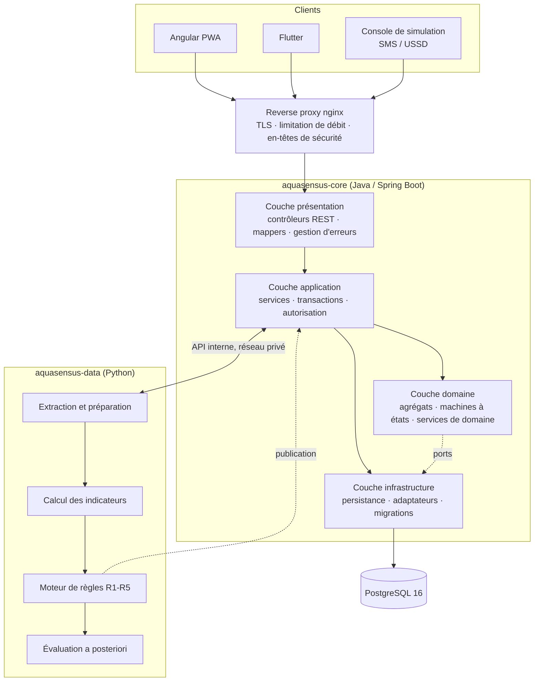
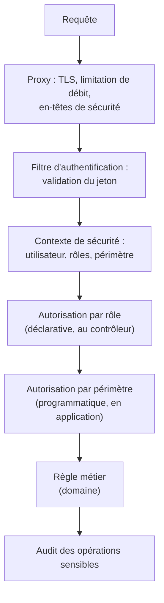
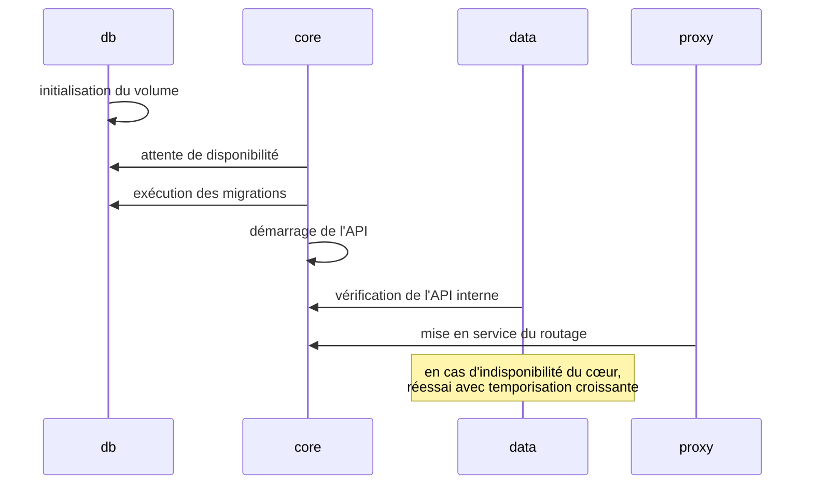

# AquaSensus — Cahier de conception

**Du modèle métier à l'architecture réalisable**

| Métadonnée | Valeur |
| --- | --- |
| Référence | AQS-CNC-001 |
| Version | 1.1 |
| Statut | Validé — entrée du développement |
| Nature | Conception technique détaillée |
| Document maître | `docs/CONTEXTE-AQUASENSUS.md` (bible) |
| Entrées | `docs/CAHIER-DES-CHARGES.md` (AQS-CDC-001), `docs/CAHIER-ANALYSE.md` (AQS-ANA-001) |
| Modélisation | `docs/diagrammes/` (AQS-UML-001) |
| Charte | `docs/CHARTE-GRAPHIQUE.md` (AQS-CHG-001) |

### Historique des révisions

| Version | Date | Nature |
| --- | --- | --- |
| 1.0 | 2026-08-26 | Création : décisions d'architecture, conception des couches, persistance, API, sécurité, moteur prédictif, fronts, déploiement, tests |
| 1.1 | 2026-08-26 | Alignement sur H-2 : le module `usage` (relevés) est remplacé par `charge` ; aucune table ni écran de volume |

---

## Position de ce document

Le cahier d'analyse a défini **quoi** modéliser, en s'interdisant toute technologie. Ce document fait l'inverse : il nomme les technologies, les couches, les fichiers, les contrats, et justifie chaque choix.

**Règle de discipline :** ce document ne crée aucune règle métier. Si une règle apparaît ici sans exister dans le cahier des charges ou le cahier d'analyse, c'est un défaut : il faut remonter la règle à sa source avant de l'implémenter.

---

## Sommaire

1. [Décisions d'architecture](#1-décisions-darchitecture)
2. [Architecture logique et physique](#2-architecture-logique-et-physique)
3. [Conception du cœur métier Java](#3-conception-du-cœur-métier-java)
4. [Conception détaillée par module](#4-conception-détaillée-par-module)
5. [Conception de la persistance](#5-conception-de-la-persistance)
6. [Conception de l'API REST](#6-conception-de-lapi-rest)
7. [Conception de la sécurité](#7-conception-de-la-sécurité)
8. [Conception du service data Python](#8-conception-du-service-data-python)
9. [Conception de la messagerie simulée](#9-conception-de-la-messagerie-simulée)
10. [Conception des fronts](#10-conception-des-fronts)
11. [Conception du mode hors ligne](#11-conception-du-mode-hors-ligne)
12. [Conception des performances](#12-conception-des-performances)
13. [Observabilité et exploitation](#13-observabilité-et-exploitation)
14. [Conception du déploiement](#14-conception-du-déploiement)
15. [Stratégie de test détaillée](#15-stratégie-de-test-détaillée)
16. [Conventions de développement](#16-conventions-de-développement)
17. [Trajectoire d'évolution](#17-trajectoire-dévolution)
18. [Traçabilité analyse → conception](#18-traçabilité-analyse--conception)

---

## 1. Décisions d'architecture

Chaque décision structurante est consignée avec son contexte, ses alternatives et ses conséquences. Une décision se révise ; elle ne se contourne pas silencieusement.

### DA-01 — Un cœur métier unique en Java, un service data séparé en Python

| Rubrique | Contenu |
| --- | --- |
| **Contexte** | Deux natures de traitement coexistent : transactions métier courtes et calculs analytiques par lots. |
| **Décision** | Le cœur métier (transactions, sécurité, machine à états) est en Java/Spring. Les calculs analytiques sont dans un service Python distinct, appelé par une API interne privée. |
| **Alternatives** | Tout en Java (calculs analytiques inclus) ; tout en Python. |
| **Justification** | Java apporte des transactions robustes et un modèle de sécurité éprouvé ; Python apporte l'outillage d'analyse de séries. Séparer permet aussi d'arrêter le moteur prédictif sans interrompre le signalement (ENF-13). |
| **Conséquences** | Une interface interne à maintenir et à sécuriser ; deux chaînes de test ; un contrat de données explicite entre les deux. |

### DA-02 — Architecture en couches avec ports et adaptateurs

| Rubrique | Contenu |
| --- | --- |
| **Décision** | Quatre couches : présentation, application, domaine, infrastructure. Le domaine ne dépend de rien ; il définit ses ports, l'infrastructure fournit les adaptateurs. |
| **Alternatives** | Architecture en couches classique avec entités JPA anémiques exposées de bout en bout. |
| **Justification** | Les règles de gestion doivent être testables sans base ni serveur, et survivre à un changement de persistance ou de canal. |
| **Conséquences** | Un mapping explicite entre entités de domaine et entités de persistance ; du code supplémentaire assumé en échange de la testabilité. |
| **Diagramme** | `docs/diagrammes/02-classes/CL8-conception-couches.puml` |

### DA-03 — Découpage par domaine métier, pas par couche technique

| Rubrique | Contenu |
| --- | --- |
| **Décision** | Les paquets de premier niveau sont `identity`, `registry`, `reporting`, `maintenance`, `charge`, `prediction`, `messaging`, `analytics`, `shared` — et non `controllers`, `services`, `repositories`. |
| **Justification** | Une évolution métier touche un domaine entier ; un découpage par couche disperserait chaque changement dans quatre paquets. |
| **Conséquences** | Chaque module expose une interface applicative et masque sa persistance. Les dépendances inter-modules passent par ces interfaces, jamais par les entités internes. |

### DA-04 — Monolithe modulaire, pas microservices

| Rubrique | Contenu |
| --- | --- |
| **Décision** | Un seul déployable Java, structuré en modules étanches. |
| **Justification** | Cible d'exploitation : une ONG ou une mairie, 2 vCPU et 4 Go de RAM, sans équipe d'exploitation. Des microservices ajouteraient un coût opérationnel sans bénéfice à cette échelle. |
| **Conséquences** | La modularité doit être défendue par des tests d'architecture, faute de quoi les frontières s'érodent. Un découpage ultérieur reste possible module par module. |

### DA-05 — Schéma de base géré exclusivement par des migrations SQL

| Rubrique | Contenu |
| --- | --- |
| **Décision** | Flyway, scripts SQL versionnés uniquement. Aucune génération de schéma par l'ORM (`ddl-auto: validate`). |
| **Justification** | Le schéma est un actif à part entière, relu, versionné, reproductible. Une génération automatique rendrait les migrations de production imprévisibles. |
| **Conséquences** | Toute évolution de modèle exige un script SQL ; les tests d'intégration exécutent les vraies migrations sur une base réelle éphémère. |

### DA-06 — Idempotence par identifiant d'origine client

| Rubrique | Contenu |
| --- | --- |
| **Décision** | Toute création issue du terrain porte un `X-Client-Request-Id` (UUID généré par le client), contraint en unicité en base. |
| **Alternatives** | Déduplication a posteriori par heuristique. |
| **Justification** | Le réseau tombe pendant la saisie. Une déduplication heuristique produirait des faux positifs sur des signalements légitimement proches. |
| **Conséquences** | Chaque table concernée porte une colonne `uuid_client` unique ; les rejeux renvoient la ressource existante avec un code 200 au lieu de 201. |

### DA-07 — Machine à états explicite plutôt qu'attribut de statut libre

| Rubrique | Contenu |
| --- | --- |
| **Décision** | Les transitions autorisées sont déclarées dans un service de domaine dédié, et toute transition non prévue est refusée avec un code 422. |
| **Justification** | Le KPI social repose entièrement sur l'intégrité des transitions. Un statut librement modifiable rendrait toute mesure contestable. |
| **Conséquences** | Un point de passage unique pour toute évolution de statut, horodaté et journalisé. |

### DA-08 — Règles interprétables plutôt qu'apprentissage automatique

| Rubrique | Contenu |
| --- | --- |
| **Décision** | Cinq règles à seuils, paramétrées et versionnées, produisant une explication en langue naturelle. |
| **Justification** | Volume de données insuffisant, exigence d'explication devant un comité, besoin de réversibilité (cf. cahier d'analyse §11). |
| **Conséquences** | Le paramétrage est une donnée applicative versionnée ; chaque alerte fige la version utilisée. |

### DA-09 — Le canal de messagerie est un port, son implémentation v1 est un simulateur

| Rubrique | Contenu |
| --- | --- |
| **Décision** | Le métier ne connaît que l'interface `MessagingGateway`. Le simulateur et une future passerelle opérateur en sont deux implémentations interchangeables. |
| **Justification** | Aucun accord opérateur n'est requis pour la v1, et le passage à un opérateur réel ne doit toucher aucune ligne de code métier. |
| **Conséquences** | Les tests métier utilisent un adaptateur en mémoire ; la console de simulation est un outil d'administration, pas une dépendance du domaine. |

### DA-10 — Pas de logique métier dans les fronts

| Rubrique | Contenu |
| --- | --- |
| **Décision** | Angular et Flutter affichent, saisissent, mettent en file et synchronisent. Aucune règle de priorité, de corroboration, de transition ou de KPI n'y est calculée. |
| **Justification** | Règle de la bible. Deux fronts multiplieraient une règle dupliquée par deux, avec dérive garantie. |
| **Conséquences** | Les fronts peuvent effectuer des validations d'ergonomie (champ requis), jamais des validations métier faisant autorité. Le serveur revalide systématiquement. |

---

## 2. Architecture logique et physique

### 2.1 Vue des composants



### 2.2 Répartition des responsabilités

| Composant | Fait | Ne fait pas |
| --- | --- | --- |
| Reverse proxy | TLS, limitation de débit, en-têtes de sécurité, service des fichiers statiques | Aucune décision métier |
| Présentation | Validation syntaxique, mapping DTO, codes HTTP, documentation d'API | Aucune règle métier, aucun accès direct à la persistance |
| Application | Orchestration, frontière transactionnelle, contrôle d'accès, publication d'événements | Aucun calcul de règle métier propre au domaine |
| Domaine | Invariants, transitions, calculs métier | Aucune dépendance à un framework |
| Infrastructure | Persistance, adaptateurs sortants, migrations | Aucune décision métier |
| Service data | Indicateurs, indice, règles, évaluation | Aucune exposition publique, aucune gestion de compte |
| PostgreSQL | Source de vérité | Aucun traitement analytique lourd |

### 2.3 Contraintes physiques

| Contrainte | Valeur cible | Conséquence de conception |
| --- | --- | --- |
| Empreinte totale | 2 vCPU, 4 Go de RAM | Un seul déployable Java ; pas de cache distribué ; pas de courtier de messages |
| Volume v1 | ~500 ouvrages, ~50 000 signalements/an | Index ciblés suffisants ; aucun partitionnement en v1 |
| Réseau terrain | 2G/3G intermittent | Charges utiles compactes, pagination stricte, mode hors ligne de première classe |
| Exploitation | Sans équipe dédiée | `docker compose up`, migrations automatiques, journaux structurés |

---

## 3. Conception du cœur métier Java

### 3.1 Structure des paquets

```
backend-java/src/main/java/org/aquasensus/
├── AquasensusApplication.java
├── shared/
│   ├── domain/            ValueObject, AggregateRoot, EvenementMetier, Montant, Periode
│   ├── error/             RegleMetierException, RessourceIntrouvableException, GestionnaireErreurs
│   ├── security/          UtilisateurCourant, PolitiqueAcces, annotations d'autorisation
│   ├── audit/             JournalAudit, intercepteur d'audit
│   └── web/               PageResponse, ProblemDetailFactory, en-têtes d'idempotence
├── identity/
│   ├── domain/            Utilisateur, Role, Permission, Perimetre, Telephone
│   ├── application/       AuthentificationService, UtilisateurService
│   ├── infrastructure/    UtilisateurRepositoryJpa, JwtTokenProvider
│   └── web/               AuthController, UserController
├── registry/              (même structure : domain / application / infrastructure / web)
├── reporting/
├── maintenance/
├── charge/            (charge d'usage estimée, calendrier saisonnier, échéance)
├── prediction/
├── messaging/
├── analytics/
└── db/migration/          V1__init.sql, V2__..., R__seed_demo.sql
```

**Règle de dépendance :** `web → application → domain`, `infrastructure → domain`. Le paquet `domain` n'importe jamais `org.springframework.*` ni `jakarta.persistence.*`. Cette règle est vérifiée par un test d'architecture automatisé (§15.5).

### 3.2 Rôle de chaque couche

| Couche | Contenu | Annotations autorisées |
| --- | --- | --- |
| `web` | Contrôleurs REST, DTO de requête et de réponse, mappers, gestion centralisée des erreurs | `@RestController`, `@Valid`, `@PreAuthorize` |
| `application` | Services applicatifs, commandes, frontière transactionnelle, publication d'événements | `@Service`, `@Transactional` |
| `domain` | Agrégats, objets valeur, énumérations, services de domaine, interfaces de dépôt | **Aucune** |
| `infrastructure` | Implémentations de dépôts, entités de persistance, adaptateurs sortants, configuration | `@Repository`, `@Entity`, `@Component` |

### 3.3 Modèles d'implémentation retenus

| Modèle | Où | Ce qu'il résout |
| --- | --- | --- |
| Agrégat | `domain` | Protège les invariants d'un groupe d'objets modifiés ensemble |
| Objet valeur | `domain` | Rend impossibles des états invalides (`Téléphone`, `Période`, `DuréeRétablissement`) |
| Dépôt (port) | `domain` puis `infrastructure` | Isole le domaine de la persistance |
| Service de domaine | `domain` | Accueille une règle qui n'appartient à aucun agrégat unique (priorité, corroboration, transitions) |
| Commande | `application` | Fige l'intention d'un appel, distincte du DTO web et de l'agrégat |
| Adaptateur | `infrastructure` | Rend le canal de messagerie substituable |
| Événement de domaine | `application` | Découple la clôture d'une intervention de ses effets (notification, recalcul) |
| Machine à états | `domain` | Centralise les transitions autorisées |

### 3.4 Frontière transactionnelle

| Règle | Détail |
| --- | --- |
| TR-1 | La transaction commence et finit dans la couche application. Aucun contrôleur n'est transactionnel. |
| TR-2 | Un appel métier modifie **un seul agrégat** en écriture principale. Les effets sur d'autres agrégats passent par des événements traités après validation. |
| TR-3 | Les appels sortants (messagerie, service data) n'ont jamais lieu à l'intérieur d'une transaction ouverte : ils sont déclenchés après validation. |
| TR-4 | Les lectures d'agrégation (KPI, carte) sont en lecture seule et n'ouvrent pas de transaction en écriture. |
| TR-5 | Les traitements par lot (import CSV) découpent en transactions par élément, avec un rapport d'erreurs partiel. |

**Justification de TR-3 :** une notification envoyée dans une transaction qui échoue ensuite avertirait un comité d'un événement qui n'a jamais eu lieu.

### 3.5 Gestion des erreurs

| Situation | Exception | Code HTTP | Corps |
| --- | --- | --- | --- |
| Champ syntaxiquement invalide | `MethodArgumentNotValidException` | 400 | `problem+json` avec liste des champs |
| Non authentifié | `AuthenticationException` | 401 | Message générique |
| Rôle ou périmètre insuffisant | `AccesRefuseException` | 403 | Message générique, tentative journalisée |
| Ressource inexistante | `RessourceIntrouvableException` | 404 | Type de ressource et identifiant |
| Conflit d'état concurrent | `ConflitEtatException` | 409 | État courant côté serveur |
| Règle de gestion violée | `RegleMetierException` | 422 | Code de règle (`RG-04`) et explication |
| Quota dépassé | `QuotaDepasseException` | 429 | Délai de réessai |

Toutes les erreurs suivent le format RFC 7807 défini au §8.1 du cahier des charges. Le champ `detail` est rédigé pour être **lisible par un utilisateur**, pas seulement par un développeur : « La clôture exige un confirmateur différent du technicien déclarant. »

---

## 4. Conception détaillée par module

### 4.1 Module `identity`

| Élément | Conception |
| --- | --- |
| Agrégat | `Utilisateur` porte ses rôles, son périmètre et son état de verrouillage |
| Authentification | Jeton d'accès signé, durée 15 minutes ; jeton de rafraîchissement 7 jours, révocable, stocké haché |
| Mot de passe | Hachage à coût mémoire élevé (Argon2id), paramètres configurables |
| Verrouillage | Compteur d'échecs consécutifs, verrouillage temporaire au 5ᵉ échec |
| Périmètre | Objet valeur évalué à chaque appel, jamais mis en cache côté client |
| Réinitialisation | Code à usage unique envoyé via le port de messagerie, réponse identique que le compte existe ou non |

**Point de vigilance :** la réponse à une demande de réinitialisation ne doit jamais révéler l'existence d'un compte. C'est une exigence de conception qui doit résister à l'envie d'améliorer le message d'erreur.

**Diagrammes :** `CL1-identite-rbac.puml`, `SQ1-authentification.puml`

### 4.2 Module `registry`

| Élément | Conception |
| --- | --- |
| Agrégat | `PointEau` avec son historique d'états |
| Changement d'état | Méthode unique `changerEtat(nouvelÉtat, motif, auteur)` produisant systématiquement une entrée d'historique |
| Suppression | Logique uniquement (`actif = false`) |
| Import CSV | Traitement par lot avec rapport ligne à ligne, transaction par ligne |
| Carte | Projection allégée dédiée (`/water-points/map`), sans les champs lourds |
| Recherche géographique | Colonnes numériques et filtrage par emprise en v1 ; extension spatiale envisagée ultérieurement |

**Diagrammes :** `CL2-referentiel.puml`, `ET1-point-eau.puml`

### 4.3 Module `reporting`

| Élément | Conception |
| --- | --- |
| Agrégat | `Signalement` |
| Idempotence | Contrainte d'unicité sur `uuid_client` ; capture de la violation d'unicité et renvoi de la ressource existante |
| Corroboration | Service de domaine interrogeant les signalements de même ouvrage et même catégorie dans la fenêtre configurée |
| Priorité | Service de domaine `PolitiquePriorite`, recalculé à chaque corroboration sauf si figé manuellement |
| Déclarant | Objet valeur acceptant soit un identifiant d'utilisateur, soit un téléphone haché |
| Signalement public | Limitation de débit par empreinte de téléphone et par adresse, appliquée au niveau du proxy **et** de l'application |

**Concurrence :** deux signalements simultanés sur le même ouvrage peuvent tenter de créer chacun l'incident de référence. La conception retient un verrouillage optimiste sur l'incident candidat, avec reprise unique de l'opération en cas de conflit.

**Diagrammes :** `CL3-signalement.puml`, `AC1`, `AC2`, `SQ2`, `ET2`

### 4.4 Module `maintenance`

| Élément | Conception |
| --- | --- |
| Agrégat | `Intervention` avec jalons, compte rendu, pièces |
| Machine à états | `MachineEtatsIntervention` : table de transitions autorisées, vérification avant toute modification |
| Clôture | Vérifie le confirmateur tiers et la complétude du compte rendu, puis délègue le calcul à `CalculRetablissement` |
| Calcul du délai | Service de domaine : fin de clôture moins date du **premier signalement rattaché** |
| Dossier de préparation | Projection construite à la demande à partir de trois sources (symptômes, historique, pièces) |
| Réouverture | Nouvelle intervention avec lien de filiation vers l'originale |
| Effets de clôture | Émis en événements : résolution des signalements, changement d'état de l'ouvrage, recalcul d'indice, notifications |

**Diagrammes :** `CL4-maintenance.puml`, `AC3`, `SQ5`, `SQ7`, `ET3`

### 4.5 Module `charge`

| Élément | Conception |
| --- | --- |
| Objet valeur | `ChargeUsage` : recalculée à chaque évaluation, jamais persistée comme saisie |
| Agrégat | `CalendrierSaisonnier` : périodes et coefficients par localité |
| Calcul | Service de domaine `CalculChargeUsage` (Java) et recalcul quotidien côté Python ; les deux s'appuient sur la même formule (CDC §9.3) |
| Unité | Jours pondérés exclusivement. Aucune conversion vers des litres, bidons ou minutes de pompage |
| Écran | Fiche ouvrage : charge cumulée, intervalle effectif, échéance, phrase d'explication. **Aucun formulaire de saisie de volume** |
| Confiance | Dégradée si population absente ou date de référence inconnue (RG-08) |

**Choix de conception :** ne pas « compenser » l'absence de compteur par une saisie estimée. Une estimation humaine quotidienne serait aussi fictive qu'un capteur, et plus coûteuse en temps bénévole. Le proxy calendaire est honnête : il se présente comme une estimation, et le poids de l'indice reste majoritairement sur les faits observés (signalements, pannes).

**Diagrammes :** `CL5-charge-usage.puml`, `AC6-calcul-charge-usage.puml`, `UC4-charge-saisonnalite.puml`

### 4.6 Module `prediction`

| Élément | Conception |
| --- | --- |
| Rôle du module Java | Reçoit, stocke et expose les indices et alertes ; gère le **cycle de vie** des alertes |
| Rôle du service Python | Calcule les indicateurs, l'indice et déclenche les règles |
| Frontière | Le Java ne calcule aucun indicateur ; le Python ne gère aucun statut d'alerte au-delà de l'émission et de l'issue |
| Anti-saturation | Contrainte d'unicité partielle : une seule alerte active par couple ouvrage/règle |
| Paramétrage | Entité versionnée ; chaque alerte et chaque indice référencent la version utilisée |
| Facteurs | Stockés en document structuré, lus tels quels par les fronts pour l'affichage explicatif |

**Diagrammes :** `CL6-prediction.puml`, `AC4`, `AC5`, `SQ8`, `ET4`

### 4.7 Module `analytics`

| Élément | Conception |
| --- | --- |
| Rôle | Agrégations de restitution : KPI, exports, données de carte |
| Implémentation | Requêtes SQL dédiées en lecture seule, sans passer par les agrégats |
| Justification | Charger des agrégats pour calculer une médiane serait coûteux et inutile ; les projections de lecture sont assumées comme un chemin distinct de celui de l'écriture |
| Export | Génération en flux, sans matérialisation complète en mémoire |
| Cache | Résultats de KPI mis en cache en mémoire avec durée de vie courte, invalidés à la clôture d'une intervention |

### 4.8 Module `shared`

Contient uniquement ce qui est authentiquement transverse : types de base, erreurs, sécurité, audit, pagination. **Aucun concept métier n'y est admis** : un objet qui semble transverse est presque toujours la propriété d'un domaine particulier.

---

## 5. Conception de la persistance

### 5.1 Organisation des migrations

```
db/migration/
├── V1__schema_initial.sql          localites, comites, utilisateurs, roles
├── V2__referentiel.sql             points d'eau, historique d'etat, pieces jointes
├── V3__signalements.sql            signalements, corroboration
├── V4__interventions.sql           interventions, jalons, pieces remplacees
├── V5__calendrier_saisonnier.sql   saisons, coefficients
├── V6__prediction.sql              indices de sante, alertes, parametrage
├── V7__messagerie.sql              messages simules, sessions ussd, notifications
├── V8__audit.sql                   journal d'audit en insertion seule
├── V9__index_performance.sql       index de restitution
└── R__seed_demo.sql                jeu de démonstration (profil demo uniquement)
```

| Règle | Détail |
| --- | --- |
| MI-1 | Un script livré n'est jamais modifié ; toute correction fait l'objet d'un nouveau script |
| MI-2 | Chaque script est réversible **par conception documentée**, à défaut de l'être automatiquement |
| MI-3 | Aucune suppression de colonne sans script de reprise documenté (DO-9) |
| MI-4 | Les scripts répétables (`R__`) ne s'exécutent qu'en profil `demo` |
| MI-5 | Les tests d'intégration exécutent la totalité des migrations sur une base réelle éphémère, à chaque exécution |

### 5.2 Correspondance domaine ↔ persistance

| Concept d'analyse | Table | Écart assumé |
| --- | --- | --- |
| `PointEau` + `Coordonnees` | `point_eau` (latitude, longitude en colonnes) | L'objet valeur est aplati, reconstruit au chargement |
| `Signalement` + `Declarant` | `signalement` (`declarant_utilisateur_id`, `declarant_telephone`) | Aplati ; l'invariant « l'un ou l'autre » est vérifié par contrainte |
| `Intervention` + `CompteRendu` | `intervention` (diagnostic, cause_racine, actions) | Aplati ; la complétude est vérifiée dans le domaine |
| `Intervention` + `JalonIntervention` | Colonnes d'horodatage par transition | Choix de simplicité : les états sont en nombre fixe et connu |
| `IndiceSante` + `Facteur` | `indice_sante.facteurs` en document structuré | Les facteurs sont lus en bloc, jamais requêtés unitairement |
| `Alerte` + `Facteur` | `alerte.facteurs` en document structuré | Idem |

**Principe :** l'écart entre modèle de domaine et modèle relationnel est **explicite et documenté**, jamais subi. Chaque aplatissement est justifié par un usage réel.

### 5.3 Index et contraintes

| Table | Index | Justification |
| --- | --- | --- |
| `point_eau` | `(localite_id, etat)` | Filtrage de la carte et de la file de travail |
| `point_eau` | `(code)` unique | Référence lisible, saisie par SMS |
| `signalement` | `(point_eau_id, declare_le desc)` | Recherche de corroboration dans la fenêtre |
| `signalement` | `(uuid_client)` unique | Idempotence |
| `signalement` | `(statut, priorite)` | File de qualification triée |
| `intervention` | `(point_eau_id, statut)` | Interventions en cours d'un ouvrage |
| `intervention` | `(technicien_id, statut)` | Liste de travail du technicien |
| `calendrier_saison` | `(localite_id)` | Pondération de la charge d'usage |
| `alerte` | `(point_eau_id, statut)` | Alertes actives |
| `alerte` | `(point_eau_id, regle)` partiel sur statut actif | Contrainte d'anti-saturation |
| `indice_sante` | `(point_eau_id, date_calcul desc)` | Dernier indice connu |
| `journal_audit` | `(entite, entite_id, horodatage desc)` | Consultation du journal |

### 5.4 Concurrence

| Situation | Mécanisme |
| --- | --- |
| Deux signalements simultanés sur le même ouvrage | Verrouillage optimiste sur l'incident candidat, reprise unique |
| Deux transitions simultanées sur une intervention | Colonne de version ; la seconde échoue en 409 avec l'état courant |
| Synchronisation hors ligne concurrente | Idempotence par `uuid_client`, puis vérification de transition |
| Traitement quotidien pendant une saisie | Le service data ne verrouille rien : il lit un instantané et écrit des lignes nouvelles |

### 5.5 Rétention et cycle de vie des données

| Donnée | Rétention | Traitement en fin de vie |
| --- | --- | --- |
| Signalement, intervention | Illimitée | Mémoire technique de l'ouvrage |
| Téléphone de déclarant public | 12 mois | Effacement de l'empreinte, conservation du signalement anonymisé |
| Message simulé | 6 mois | Purge planifiée |
| Journal d'audit | 24 mois | Archivage puis purge |
| Journaux applicatifs | 30 jours | Rotation automatique |

---

## 6. Conception de l'API REST

L'inventaire complet des points d'entrée figure au §8.2 du cahier des charges. Ce chapitre en précise les mécanismes.

### 6.1 Traitement de l'idempotence

```
Requête de création avec X-Client-Request-Id
        │
        ├─ En-tête absent et point d'entrée terrain ? ──> 400
        │
        ├─ Recherche par uuid_client
        │       ├─ Trouvé ──> 200 + ressource existante (aucune écriture)
        │       └─ Absent ──> création
        │
        └─ Violation d'unicité concurrente ──> relecture ──> 200 + ressource existante
```

Le double filet (recherche préalable **et** capture de la violation d'unicité) est nécessaire : deux rejeux simultanés passeraient tous deux la recherche préalable.

### 6.2 Conception des DTO

| Règle | Détail |
| --- | --- |
| DTO-1 | Les DTO de requête et de réponse sont distincts des agrégats et des entités de persistance |
| DTO-2 | Une réponse n'expose jamais un identifiant technique interne autre que l'UUID fonctionnel |
| DTO-3 | Les réponses destinées au terrain sont compactes : la fiche de carte ne porte pas l'historique complet |
| DTO-4 | Les champs sont en `snake_case`, les horodatages en ISO 8601 avec fuseau |
| DTO-5 | Une réponse de signalement inclut toujours le bloc de prise en charge : c'est ce qui rassure le déclarant |

### 6.3 Pagination et filtrage

| Aspect | Choix |
| --- | --- |
| Pagination | Par page et taille, taille maximale plafonnée à 100 |
| Tri | Liste blanche de champs triables par ressource |
| Filtrage | Paramètres nommés explicites uniquement ; aucun langage de requête exposé |
| Périmètre | Appliqué **avant** la pagination, côté serveur, jamais en filtre client |

### 6.4 Versionnement

La version majeure figure dans le chemin (`/api/v1`). Un ajout de champ optionnel ou d'un point d'entrée n'incrémente pas la version. Une suppression de champ, un changement de type ou de sémantique impose une version majeure et une période de coexistence documentée.

### 6.5 API interne Java ↔ Python

| Aspect | Choix |
| --- | --- |
| Isolation | Réseau privé du conteneur, non routée par le proxy |
| Authentification | Secret partagé injecté par variable d'environnement |
| Extraction | Incrémentale par horodatage, avec pagination |
| Publication | Écritures groupées d'indices puis d'alertes, idempotentes par couple ouvrage/date |
| Résilience | Reprise avec temporisation croissante ; un échec n'interrompt pas le traitement des autres ouvrages |
| Contrat | Schéma versionné, testé des deux côtés par des tests de contrat |

---

## 7. Conception de la sécurité

### 7.1 Chaîne de contrôle d'une requête



**Point de conception essentiel :** l'autorisation par rôle ne suffit jamais. Un délégué a le rôle de qualifier ; encore faut-il vérifier que l'ouvrage concerné appartient à son périmètre. Ces deux contrôles sont à deux endroits distincts, et le second ne peut pas être déclaratif car il dépend de la donnée manipulée.

### 7.2 Mesures par surface d'attaque

| Surface | Mesure |
| --- | --- |
| Signalement public | Limitation de débit par empreinte de téléphone et par adresse, vérification par code à usage unique, quota horaire |
| Authentification | Verrouillage progressif, réponses génériques, hachage à coût mémoire élevé |
| Jetons | Durée courte, rafraîchissement révocable stocké haché, révocation en cascade à la suspension du compte |
| Injection | Requêtes paramétrées exclusivement ; aucune concaténation SQL |
| Données personnelles | Téléphone haché, quatre derniers chiffres seuls en clair, anonymisation à 12 mois |
| Fichiers joints | Type MIME vérifié par contenu, taille plafonnée, stockage hors racine web, nom généré |
| API interne | Réseau privé, secret partagé, non routée publiquement |
| Journal d'audit | Insertion seule, aucune mise à jour ni suppression accordée à l'application |
| Dépendances | Audit de vulnérabilités bloquant en intégration continue |

### 7.3 Ce que la sécurité ne fait pas

Le projet refuse explicitement le KYC lourd. La conception de sécurité doit donc protéger sans identifier : un habitant peut signaler avec un numéro vérifié une fois, sans pièce d'identité, sans compte, sans consentement complexe. La sécurité protège **le système et les données**, elle ne surveille pas les personnes.

---

## 8. Conception du service data Python

### 8.1 Structure

```
data-python/
├── aquasensus_data/
│   ├── extraction/     client de l'API interne, extraction incrémentale
│   ├── preparation/    déduplication, constitution du calendrier applicable
│   ├── indicateurs/    calcul de M, P, S, T et de la confiance
│   ├── indice/         agrégation pondérée, bandes, version de paramétrage
│   ├── regles/         R1 à R5, une classe par règle
│   ├── explication/    composition du texte explicatif et des facteurs
│   ├── evaluation/     issue des alertes, taux d'anticipation et de fausses alertes
│   └── ordonnancement/ déclenchement quotidien et sur événement
└── tests/              un module de test par indicateur et par règle
```

### 8.2 Conception du moteur de règles

Chaque règle est un objet autonome exposant trois capacités : savoir si elle s'applique, produire son explication, et déclarer son niveau. Ajouter une sixième règle ne doit modifier aucune règle existante.

| Élément | Conception |
| --- | --- |
| Interface commune | `sApplique(profil)`, `expliquer(profil)`, `niveau` |
| Enregistrement | Les règles sont déclarées dans un registre ; l'ordre d'évaluation est explicite |
| Paramétrage | Injecté à la construction, jamais lu globalement |
| Traçabilité | Chaque déclenchement produit les facteurs ayant contribué, avec valeur observée et seuil |

### 8.3 Traitement des données incomplètes

| Situation | Traitement | Effet sur la sortie |
| --- | --- | --- |
| Historique inférieur à 90 jours | Aucune alerte fondée sur `M` (RG-16) | Indice publié en confiance faible |
| Population desservie inconnue | `M` calculé avec l'intervalle de base, confiance faible | Phrase d'explication invitant à compléter la fiche |
| Aucune maintenance ni mise en service | `M` non calculé | Confiance faible, seules R2, R3, R5 peuvent se déclencher |
| Calendrier saisonnier absent | Coefficient 1,0 partout | Charge non pondérée, mentionné dans l'explication |

**Principe directeur :** le moteur préfère se taire plutôt que produire une alerte non fondée. Un comité qui reçoit trois fausses alertes cesse de lire les suivantes.

### 8.4 Reproductibilité

| Exigence | Mise en œuvre |
| --- | --- |
| Rejouabilité | Le traitement d'une date donnée peut être rejoué et produit le même résultat |
| Version de paramétrage | Écrite dans chaque indice et chaque alerte |
| Jeu de démonstration | Graine fixe, 12 mois d'historique simulé, utilisé en test et en validation rétrospective |
| Validation rétrospective | Le moteur est évalué sur l'historique simulé avant toute mise en service |

**Diagrammes :** `AC4-calcul-indice-alerte.puml`, `SQ8-pipeline-prediction.puml`, `CL6-prediction.puml`

---

## 9. Conception de la messagerie simulée

### 9.1 Port et adaptateurs

| Élément | Conception |
| --- | --- |
| Port | `MessagingGateway` : `envoyer(MessageSortant)`, `supporte(Canal)` |
| Adaptateur v1 | Simulateur local : journalise, alimente la console d'administration, ne sort jamais du système |
| Adaptateur de test | Implémentation en mémoire, assertions sur les messages émis |
| Adaptateur futur | Passerelle opérateur, ajoutée sans modification du domaine |
| Sélection | Par configuration, une seule implémentation active à la fois |

### 9.2 Analyse des messages entrants

| Aspect | Choix |
| --- | --- |
| Format | `AQS <code_ouvrage> <code_symptôme> [commentaire libre]` |
| Tolérance | Insensible à la casse, espaces multiples tolérés, accents non requis |
| Échec d'analyse | Réponse d'aide explicite, message entrant néanmoins journalisé |
| Réponse | 160 caractères maximum, alphabet GSM-7, aucun émoji (charte §12.4) |

### 9.3 Sessions USSD

| Aspect | Choix |
| --- | --- |
| État | Conservé côté serveur, identifié par session, expirant après 90 secondes d'inactivité |
| Arborescence | Déclarée en machine à étapes, chaque étape produisant un texte et attendant une saisie |
| Reprise | Une session expirée n'est jamais reprise : elle est recréée, pour éviter toute confusion de contexte |
| Journalisation | Chaque échange entrant et sortant est journalisé, comme pour les SMS |

**Diagrammes :** `CL7-messagerie-simulee.puml`, `SQ3-signalement-sms.puml`, `SQ4-session-ussd.puml`

---

## 10. Conception des fronts

### 10.1 Répartition entre les deux fronts

| Front | Public visé | Parcours prioritaires |
| --- | --- | --- |
| Angular PWA | Habitants connectés, délégués, partenaires, administrateurs | Carte, signalement, file de qualification, tableau de bord, administration |
| Flutter | Techniciens et délégués sur le terrain | Signalement, intervention, consultation de la fiche et de l'échéance |

Les deux consomment la même API et n'implémentent aucune règle métier (DA-10).

### 10.2 Conception de l'application Angular

| Aspect | Choix |
| --- | --- |
| Structure | Par fonctionnalité (`carte`, `signalement`, `interventions`, `tableau-de-bord`, `administration`), avec un noyau partagé |
| Chargement | Modules chargés à la demande ; le parcours de signalement est prioritaire au premier chargement |
| État | Service d'état par fonctionnalité, avec flux observables ; aucune bibliothèque lourde imposée |
| Style | Consommation directe des jetons de `docs/design/tokens.css` ; aucune couleur codée en dur |
| Carte | Bibliothèque cartographique légère, tuiles mises en cache, marqueurs groupés au-delà d'un seuil |
| Hors ligne | Travailleur de service, cache applicatif, file de synchronisation persistante |
| Accessibilité | Contraste conforme, navigation clavier, libellés explicites, état jamais porté par la seule couleur |
| Identité | Logo par défaut `docs/design/aquasensus-logo.png`, variante inversée sur fond sombre, symbole pour l'icône applicative |

### 10.3 Conception de l'application Flutter

| Aspect | Choix |
| --- | --- |
| Structure | Par fonctionnalité, miroir de l'Angular pour faciliter la maintenance croisée |
| État | Gestion d'état déclarative, sans logique métier dans les widgets |
| Persistance locale | Base locale embarquée pour la file de synchronisation et le cache du périmètre |
| Thème | Construit depuis `docs/design/tokens.dart` |
| Saisie terrain | Cibles tactiles larges, contraste renforcé pour usage en plein soleil, saisie possible d'une main |
| Réseau | Détection d'état, bandeau permanent en mode hors ligne, compteur d'éléments en attente |

### 10.4 Règles communes aux deux fronts

| Règle | Détail |
| --- | --- |
| FR-1 | Aucune règle de priorité, de corroboration, de transition ou de KPI n'est calculée côté client |
| FR-2 | Les libellés d'état proviennent d'une source unique et sont identiques dans les deux fronts |
| FR-3 | Les couleurs proviennent exclusivement des jetons de la charte |
| FR-4 | Toute action terrain génère un identifiant d'origine client avant l'envoi |
| FR-5 | Un état de synchronisation est visible pour tout élément non confirmé par le serveur |
| FR-6 | Les messages d'erreur affichés sont ceux du serveur, jamais des reformulations locales divergentes |
| FR-7 | Aucun écran n'affiche ni ne saisit un volume d'eau (litres, bidons, seaux, minutes de pompage). La charge d'usage se lit en jours pondérés, avec la mention « estimation » |

---

## 11. Conception du mode hors ligne

### 11.1 Modèle de la file locale

| Champ | Rôle |
| --- | --- |
| `uuid_client` | Identifiant d'idempotence, généré à la saisie |
| `type_operation` | Signalement, transition, compte rendu |
| `charge_utile` | Corps de la requête, figé à la saisie |
| `statut` | En attente, envoyé, en conflit |
| `tentatives` | Compteur pour la temporisation croissante |
| `cree_le` | Ordre de traitement (premier entré, premier sorti) |
| `erreur` | Dernier message d'erreur serveur, conservé pour affichage |

### 11.2 Cycle de synchronisation

| Étape | Comportement |
| --- | --- |
| Saisie | Écriture locale immédiate, retour visuel instantané |
| Détection de réseau | Déclenchement automatique, plus déclenchement manuel possible |
| Envoi | Séquentiel, dans l'ordre de saisie, avec l'en-tête d'idempotence |
| Succès | Marquage envoyé, purge de la file |
| Déjà traité | Réponse 200 : traité comme un succès |
| Échec réseau | Conservation, temporisation croissante plafonnée |
| Conflit métier | Marquage en conflit, conservation de la version locale, application de la version serveur, information de l'utilisateur |

### 11.3 Traitement des conflits

Le conflit typique : un technicien déclare une intervention réalisée hors ligne, alors qu'un délégué l'a annulée entre-temps. La conception retient trois principes :

1. **Le serveur fait autorité** sur l'état métier.
2. **La saisie locale n'est jamais détruite** : elle est conservée et consultable.
3. **L'utilisateur est informé explicitement**, avec l'état serveur et l'action possible.

Aucune résolution automatique silencieuse n'est admise : sur le terrain, une donnée écrasée sans avertissement détruit la confiance dans l'outil.

**Diagrammes :** `AC7-synchronisation-hors-ligne.puml`, `SQ6-intervention-hors-ligne.puml`

---

## 12. Conception des performances

### 12.1 Cibles et moyens

| Exigence | Cible | Moyen de conception |
| --- | --- | --- |
| ENF-01 | Chargement du parcours de signalement rapide sur 3G | Chargement à la demande, budget de poids initial, images optimisées |
| ENF-02 | Création d'un signalement fluide | Une seule écriture principale, notifications émises après validation |
| ENF-06 | Carte réactive à plusieurs centaines d'ouvrages | Projection allégée, groupement de marqueurs, filtrage côté serveur |
| — | Tableau de bord KPI | Requêtes d'agrégation dédiées, cache court invalidé à la clôture |
| — | Traitement quotidien | Extraction incrémentale, traitement par ouvrage, aucun verrouillage global |

### 12.2 Points de vigilance identifiés

| Risque | Conception préventive |
| --- | --- |
| Requêtes en cascade sur les listes | Projections de lecture dédiées, jamais de chargement d'agrégats pour une liste |
| Croissance du journal d'audit | Index ciblé, rétention 24 mois, archivage planifié |
| Recherche de corroboration à chaque signalement | Index composé sur ouvrage et date, fenêtre bornée |
| Export volumineux | Génération en flux, plafond documenté |
| Photos jointes | Redimensionnement côté client avant envoi, taille plafonnée côté serveur |

---

## 13. Observabilité et exploitation

| Aspect | Conception |
| --- | --- |
| Journaux | Structurés, un identifiant de corrélation par requête, propagé jusqu'au service data |
| Niveaux | Aucune donnée personnelle en journal ; le téléphone n'apparaît jamais, même masqué |
| Métriques | Latence par point d'entrée, taux d'erreur, durée du traitement quotidien, taille de la file de notifications |
| Sondes | Vivacité et disponibilité distinctes ; la disponibilité vérifie l'accès à la base |
| Alertes d'exploitation | Échec du traitement quotidien, échec de migration, espace disque, taux d'erreur anormal |
| Traçabilité métier | Le journal d'audit répond à « qui a changé quoi et quand », en insertion seule |

**Distinction importante :** le journal technique sert à diagnostiquer une panne du logiciel ; le journal d'audit sert à rendre des comptes sur une décision métier. Ils ont des rétentions, des accès et des formats différents, et ne doivent pas être confondus.

---

## 14. Conception du déploiement

### 14.1 Composition des services

| Service | Image | Rôle |
| --- | --- | --- |
| `proxy` | nginx | TLS, limitation de débit, fichiers statiques de la PWA |
| `core` | Java, image d'exécution minimale | Cœur métier, migrations au démarrage |
| `data` | Python, image d'exécution minimale | Traitement quotidien et à la demande |
| `db` | PostgreSQL | Source de vérité, volume persistant |

### 14.2 Principes

| Principe | Détail |
| --- | --- |
| DEP-1 | Images multi-étapes : aucun outil de compilation dans l'image finale |
| DEP-2 | Configuration exclusivement par variables d'environnement, avec un exemple documenté |
| DEP-3 | Les migrations s'exécutent au démarrage du cœur ; leur échec interrompt le démarrage |
| DEP-4 | Le service data démarre après le cœur, et tolère son indisponibilité temporaire |
| DEP-5 | Aucun secret dans l'image ni dans le dépôt |
| DEP-6 | Trois profils : développement, démonstration, production ; le jeu de démonstration est impossible à charger en production |
| DEP-7 | Sauvegarde quotidienne chiffrée, restauration testée au moins une fois par lot |

### 14.3 Ordre de démarrage



---

## 15. Stratégie de test détaillée

### 15.1 Principe

Développement piloté par les tests sur le cœur métier et le moteur prédictif : le test d'acceptation d'une exigence est écrit avant l'implémentation (§13.1 du cahier des charges).

### 15.2 Tests du domaine

| Objet | Tests obligatoires |
| --- | --- |
| Machine à états des interventions | Chaque transition autorisée, chaque transition interdite, refus du confirmateur identique au déclarant |
| Calcul du temps de rétablissement | Départ au premier signalement rattaché, cas sans signalement, cas de réouverture |
| Corroboration | Dans la fenêtre, hors fenêtre, catégorie différente, ouvrage différent |
| Politique de priorité | Effet de la gravité, des corroborations, de la population ; priorité figée manuellement |
| Objets valeur | Téléphone jamais en clair, période sans chevauchement, invariants du déclarant |
| Périmètre | Couverture d'un ouvrage du comité, refus hors périmètre |

### 15.3 Tests d'intégration

| Portée | Ce qui est vérifié |
| --- | --- |
| Migrations | Exécution complète sur base réelle éphémère, à chaque exécution de la suite |
| Contraintes | Unicité d'idempotence, unicité partielle d'alerte active, contraintes de cohérence |
| Contrôle d'accès | Chaque point d'entrée testé avec un rôle autorisé et un rôle non autorisé |
| Périmètre | Un délégué d'un comité ne peut pas agir sur l'ouvrage d'un autre |
| Idempotence | Rejeu simple et rejeu concurrent |
| Contrats REST | Codes de statut, format d'erreur, pagination |

### 15.4 Tests du moteur prédictif

| Portée | Ce qui est vérifié |
| --- | --- |
| Chaque indicateur | Cas nominal, données manquantes, valeurs extrêmes |
| Chaque règle R1 à R5 | Déclenchement, non-déclenchement, explication produite |
| Cas limites | Ouvrage neuf, historique insuffisant, part imputée élevée, valeurs aberrantes |
| Anti-saturation | Aucune seconde alerte active de même règle |
| Reproductibilité | Deux exécutions sur la même date produisent le même résultat |
| Validation rétrospective | Taux d'anticipation mesuré sur le jeu de démonstration |

### 15.5 Tests d'architecture

Des tests automatisés vérifient les règles structurelles, car une règle d'architecture non testée se dégrade en quelques semaines :

| Règle vérifiée |
| --- |
| Le paquet `domain` n'importe aucun framework |
| Aucun contrôleur n'accède directement à un dépôt |
| Aucun module métier n'importe les classes internes d'un autre module |
| Aucune entité de persistance n'est exposée par un contrôleur |
| Aucune annotation transactionnelle en dehors de la couche application |

### 15.6 Tests des parcours critiques

| Parcours | Portée |
| --- | --- |
| Signalement jusqu'au rétablissement | Bout en bout, y compris le calcul du KPI |
| Signalement hors ligne puis synchronisation | Coupure pendant la saisie, rejeu, conflit |
| Alerte prédictive jusqu'à l'intervention préventive | Émission, acquittement, intervention, issue |
| Signalement par SMS | Analyse, création, accusé de réception |
| Accessibilité | Contrôle automatisé plus revue manuelle sur les parcours critiques |

---

## 16. Conventions de développement

| Domaine | Convention |
| --- | --- |
| Langue du code | Anglais pour les mots-clés techniques inévitables, **français pour le vocabulaire métier** (`Signalement`, `PointEau`, `cloturer`) |
| Langue des messages utilisateur | Français, ton de la charte : sobre, direct, sans jargon |
| Nommage des tables et colonnes | `snake_case`, français métier |
| Nommage des points d'entrée | Anglais, conforme à l'inventaire du cahier des charges |
| Commentaires | Uniquement pour expliquer une contrainte non déductible du code ; jamais pour paraphraser |
| Format | Formateur automatique par langage, vérifié en intégration continue |
| Revue | Toute fusion exige une revue ; une règle de gestion modifiée exige la mise à jour du test correspondant |
| Documentation | Une modification de règle métier met à jour le cahier des charges, l'analyse et les diagrammes concernés |

**Sur le mélange de langues :** il est assumé et cadré. Le vocabulaire métier reste en français parce que c'est la langue des comités, des délégués et des documents du projet. Traduire `Signalement` en `Report` créerait un décalage permanent entre le code et les échanges avec les utilisateurs.

---

## 17. Trajectoire d'évolution

| Évolution | Ce qui est déjà prêt | Ce qui resterait à faire |
| --- | --- | --- |
| Passerelle SMS réelle | Le port `MessagingGateway` et son adaptateur substituable | Écrire l'adaptateur opérateur, gérer les accusés de réception et les coûts |
| Capteurs de terrain | Aucune colonne « volume » à réinterpréter : un débitmètre serait un **nouveau domaine**, pas une évolution de `charge` | Ingestion, calibration, gestion de la panne de capteur — uniquement si le terrain le justifie |
| Entrepôt analytique | La séparation du service data et son extraction incrémentale | Format de stockage colonne, orchestration, historisation longue |
| Modèles appris | L'évaluation a posteriori des alertes et le jeu de démonstration | Volume de données suffisant, exigence d'explication maintenue |
| Extraction d'un module en service | La modularité par domaine et les interfaces applicatives | Contrat inter-services, cohérence transactionnelle |
| Multi-langue | Aucune chaîne codée en dur dans les fronts | Catalogues de traduction, adaptation des messages SMS |

**Règle de trajectoire :** aucune de ces évolutions ne doit être anticipée par du code inutilisé. Elles sont préparées par des **frontières propres**, pas par des abstractions spéculatives.

---

## 18. Traçabilité analyse → conception

| Élément d'analyse | Réalisation en conception | Section |
| --- | --- | --- |
| Sept domaines métier | Sept paquets Java autonomes | §3.1, DA-03 |
| Cinq agrégats | Cinq racines avec dépôts dédiés | §4 |
| Objet valeur `Téléphone` | Hachage en base, quatre derniers chiffres, anonymisation à 12 mois | §5.5, §7.2 |
| Objet valeur `Périmètre` | Contrôle d'accès programmatique en couche application | §7.1 |
| `DuréeRétablissement` | Service de domaine `CalculRetablissement` | §4.4 |
| Machines à états (4) | Services de domaine dédiés, transitions refusées en 422 | DA-07, §4 |
| Idempotence d'origine client | En-tête, colonne unique, double filet | DA-06, §6.1 |
| Corroboration | Service de domaine, index composé, verrouillage optimiste | §4.3, §5.3 |
| Indicateurs et règles | Service Python, une classe par règle, registre | §8.2 |
| Explicabilité des alertes | Facteurs structurés, version de paramétrage figée | §4.6, §8.2 |
| Confiance des données | Complétude du référentiel et profondeur d'historique, jamais une part de relevés imputés | §8.3 |
| Canal comme attribut | Port de messagerie, adaptateurs interchangeables | DA-09, §9 |
| Contraintes de terrain | File locale, conflits visibles, saisie jamais détruite | §11 |
| Règles négatives (RG-07, RG-11, RG-12, RG-13) | Tests unitaires dédiés | §15.2 |

---

*Fin du cahier de conception AQS-CNC-001 v1.0.*
