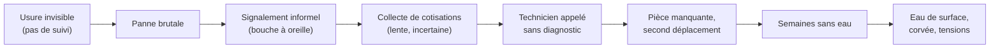
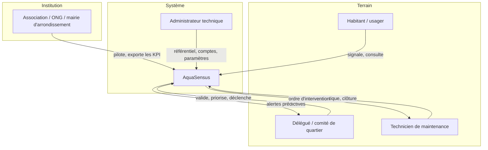
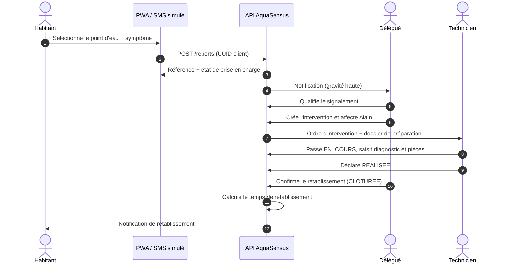
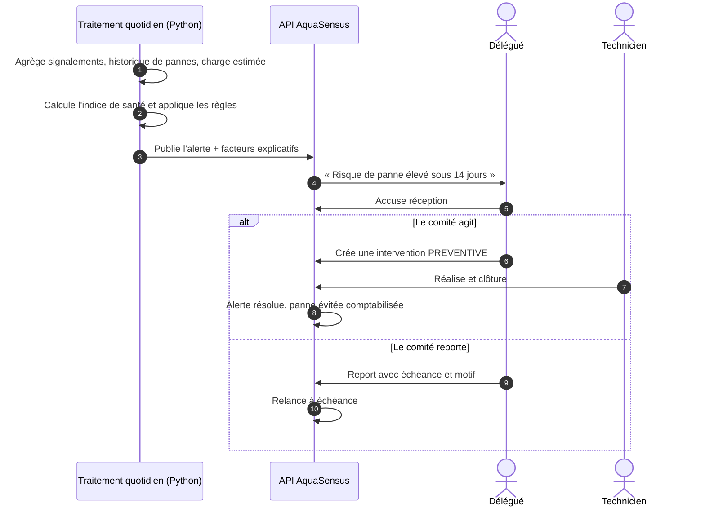
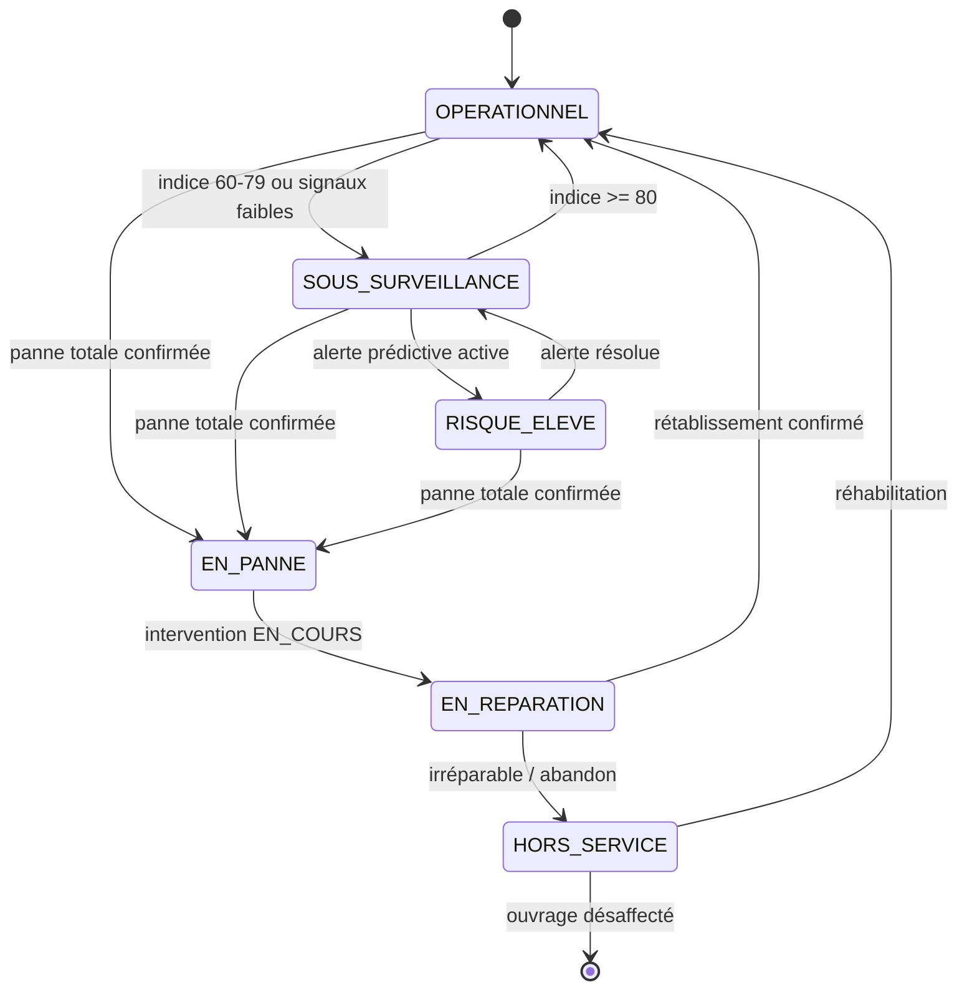
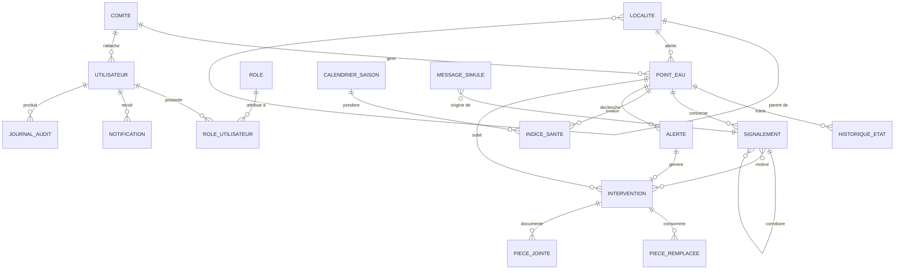
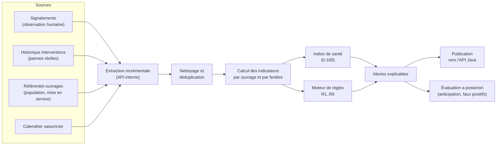
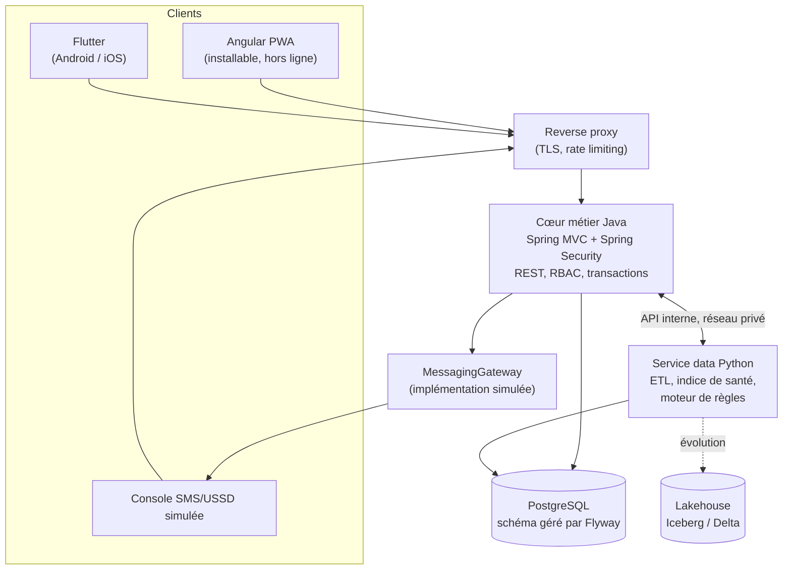
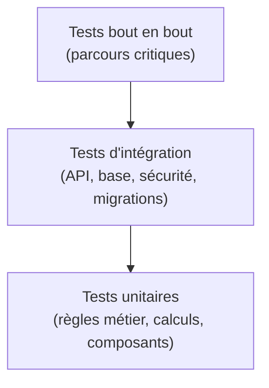

# AquaSensus — Cahier des charges

**Plateforme de suivi et de maintenance prédictive des forages communautaires**

| Métadonnée | Valeur |
| --- | --- |
| Référence | AQS-CDC-001 |
| Version | 1.1 |
| Statut | Validé pour lancement du lot L0 |
| Type | Cahier des charges fonctionnel et technique (CdCF + spécifications) |
| Périmètre | Version 1 (v1) de la plateforme |
| Territoire | Quartiers périphériques de Yaoundé, zones rurales et semi-rurales du Cameroun |
| Document maître | `docs/CONTEXTE-AQUASENSUS.md` (bible — prévaut en cas de contradiction) |
| Documents liés | `docs/CAHIER-ANALYSE.md` (AQS-ANA-001), `docs/CAHIER-CONCEPTION.md` (AQS-CNC-001), `docs/diagrammes/` (AQS-UML-001), `docs/CHARTE-GRAPHIQUE.md`, `.cursor/rules/aquasensus-contexte.mdc`, `.cursorrules.txt` |

### Historique des révisions

| Version | Date | Auteur | Nature |
| --- | --- | --- | --- |
| 0.1 | — | Équipe projet | Pitch initial, problème social, orientation utilité publique |
| 1.0 | 2026-08-26 | Équipe projet | Cahier des charges complet : périmètre v1, exigences fonctionnelles et non fonctionnelles, modèle de données, API, moteur prédictif, lotissement, recette |
| 1.1 | 2026-08-26 | Équipe projet | Confirmation de terrain : le volume consommé est inconnaissable au quotidien (H-2). Aucun relevé, même estimé. Charge d'usage déduite du référentiel et du calendrier. |

### Convention de lecture

| Préfixe | Signification |
| --- | --- |
| `EF-nn` | Exigence fonctionnelle |
| `ENF-nn` | Exigence non fonctionnelle |
| `RG-nn` | Règle de gestion |
| `KPI-nn` | Indicateur de pilotage |
| `RSQ-nn` | Risque identifié |

Priorisation **MoSCoW** : `M` (Must, v1 bloquant), `S` (Should, v1 si tenable), `C` (Could, confort), `W` (Won't, explicitement hors v1).

---

## Sommaire

1. [Contexte, enjeux et objectifs](#1-contexte-enjeux-et-objectifs)
2. [Périmètre, hypothèses et contraintes](#2-périmètre-hypothèses-et-contraintes)
3. [Acteurs, personas et contrôle d'accès](#3-acteurs-personas-et-contrôle-daccès)
4. [Exigences fonctionnelles](#4-exigences-fonctionnelles)
5. [Parcours utilisateurs de référence](#5-parcours-utilisateurs-de-référence)
6. [Règles de gestion](#6-règles-de-gestion)
7. [Modèle de données](#7-modèle-de-données)
8. [Spécification des interfaces (API REST)](#8-spécification-des-interfaces-api-rest)
9. [Chaîne data et maintenance prédictive](#9-chaîne-data-et-maintenance-prédictive)
10. [Exigences non fonctionnelles](#10-exigences-non-fonctionnelles)
11. [Architecture technique](#11-architecture-technique)
12. [Exploitation, DevOps et déploiement](#12-exploitation-devops-et-déploiement)
13. [Stratégie de test et qualité](#13-stratégie-de-test-et-qualité)
14. [Indicateurs d'impact et de pilotage](#14-indicateurs-dimpact-et-de-pilotage)
15. [Lotissement, planning et livrables](#15-lotissement-planning-et-livrables)
16. [Risques et mesures de traitement](#16-risques-et-mesures-de-traitement)
17. [Recette et critères d'acceptation](#17-recette-et-critères-dacceptation)
18. [Gouvernance documentaire](#18-gouvernance-documentaire)
19. [Glossaire](#19-glossaire)
20. [Annexes](#20-annexes)

---

## 1. Contexte, enjeux et objectifs

### 1.1 Situation actuelle

Dans les quartiers périphériques de Yaoundé et les zones rurales ou semi-rurales du Cameroun, l'accès à l'eau potable repose largement sur des **forages communautaires** et des **mini-réseaux** gérés par des comités de quartier bénévoles. Ces ouvrages sont entretenus de façon **réactive** : on répare quand la pompe est déjà morte.

La chaîne de défaillance observée est stable et documentable :



### 1.2 Problème à résoudre

| Symptôme | Conséquence mesurable |
| --- | --- |
| Absence de maintenance préventive | Pannes répétées et imprévisibles |
| Aucun historique structuré par ouvrage | Diagnostic à l'aveugle, déplacements inutiles du technicien |
| Signalement informel et non tracé | Délai avant prise en charge non maîtrisé |
| Cotisations levées après la panne | Semaines d'interruption |
| Aucun indicateur partagé | Ni la mairie, ni l'ONG, ni le comité ne peuvent arbitrer |

**Impact social :** corvée d'eau reportée sur les femmes et les enfants (temps scolaire et économique perdu), recours à l'eau de surface non potable (risque sanitaire, maladies hydriques), tensions communautaires autour de l'accès et des cotisations.

### 1.3 Objectif général

Faire passer la gestion des points d'eau communautaires d'un régime **réactif** à un régime **anticipé et coordonné**, en s'appuyant uniquement sur des données réellement disponibles sans effort de terrain : signalements des habitants, historique des pannes et des interventions, et charge d'usage estimée à partir du référentiel et du calendrier.

### 1.4 Objectifs spécifiques (SMART)

| Id | Objectif | Cible v1 |
| --- | --- | --- |
| OS-1 | Réduire le temps médian de rétablissement après signalement | −40 % vs baseline déclarée du comité pilote |
| OS-2 | Émettre une alerte d'usure avant la panne | ≥ 50 % des pannes précédées d'une alerte dans les 14 jours |
| OS-3 | Structurer l'historique de chaque ouvrage | 100 % des points d'eau du quartier pilote fichés et historisés |
| OS-4 | Rendre le signalement accessible sans smartphone | Canal SMS/USSD simulé opérationnel de bout en bout |
| OS-5 | Garantir la réappropriation par une ONG ou une mairie | Déploiement complet en une commande `docker compose up`, sous licence open-source |

### 1.5 Bénéficiaires

- **Directs :** habitants desservis par un point d'eau suivi, comités de quartier, techniciens de maintenance.
- **Indirects :** mairies d'arrondissement, associations et ONG du secteur eau-hygiène-assainissement, bailleurs (traçabilité de l'usage des fonds).

### 1.6 Principes directeurs non négociables

1. **Aucun prérequis matériel coûteux.** Le capteur IoT est une évolution possible, jamais une condition de fonctionnement.
2. **Aucune dépendance administrative bloquante.** Pas de contrat opérateur télécom, pas d'API bancaire, pas d'accord ministériel préalable.
3. **Prédiction interprétable.** Un délégué de quartier doit pouvoir comprendre et contester une alerte.
4. **Frugalité technique.** Terminaux d'entrée de gamme, réseau instable, électricité intermittente sont la norme, pas l'exception.
5. **Ouverture.** Open-source, données exportables, pas de verrou propriétaire.

---

## 2. Périmètre, hypothèses et contraintes

### 2.1 Dans le périmètre v1

| Domaine | Contenu |
| --- | --- |
| Référentiel | Points d'eau (forages, mini-réseaux), localités, comités, techniciens |
| Signalement | Déclaration d'incident par habitant, délégué, ou via SMS/USSD simulé |
| Maintenance | Cycle d'intervention complet, du signalement au rétablissement confirmé |
| Charge d'usage | Estimation de la charge subie par l'ouvrage, calculée sans aucune saisie de terrain |
| Prédiction | Indice de santé par ouvrage, alertes de seuil critique à horizon 14 jours |
| Restitution | Carte d'état, tableau de bord KPI, historique par ouvrage |
| Canal alternatif | SMS/USSD **simulé** (simulateur intégré, sans opérateur réel) |
| Socle | Authentification, RBAC, API REST documentée, PWA installable, Docker |

### 2.2 Hors périmètre v1

| Exclusion | Justification |
| --- | --- |
| Capteurs IoT physiques (débitmètres, niveau de nappe) | Coût prohibitif, dépendance matérielle. |
| Comptage des volumes tirés, sous quelque forme que ce soit | **Constat de terrain déterminant** : les populations utilisent l'installation sans que personne ne puisse dire, en fin de journée, quel volume a été consommé. Aucun compteur, aucun relevé, aucune estimation par bidons. Toute exigence supposant un comptage serait une exigence fictive. |
| Passerelle SMS/USSD réelle (contrat opérateur) | Barrière administrative. L'interface de simulation respecte un contrat d'adaptateur remplaçable. |
| Paiement en ligne des cotisations, mobile money | Contraintes KYC et réglementaires, hors fibre du projet. |
| Lakehouse (Iceberg / Delta) en production | Évolution planifiée post-v1, non bloquante pour le signalement. |
| Modèles ML complexes (deep learning, prévision temps réel) | Non interprétables, données insuffisantes en v1. |
| Application desktop native | La PWA couvre le besoin. |

### 2.3 Hypothèses de travail

| Id | Hypothèse |
| --- | --- |
| H-1 | Chaque point d'eau est rattaché à un comité identifiable disposant d'au moins un délégué joignable. |
| H-2 | Le volume d'eau consommé est **inconnu et inconnaissable** au quotidien : les habitants puisent librement, sans comptage ni relevé possible. La charge d'usage ne peut donc être qu'estimée à partir de données déjà connues : population desservie, temps écoulé depuis la dernière maintenance, saison. |
| H-3 | Au moins un membre du comité dispose d'un téléphone, éventuellement non-smartphone. |
| H-4 | La connectivité data est intermittente : la saisie terrain doit fonctionner hors ligne. |
| H-5 | Un jeu de données de démonstration réaliste peut être généré pour l'évaluation académique, en complément des retours de terrain. |

### 2.4 Contraintes

| Type | Contrainte |
| --- | --- |
| Technique | Stack imposée par la bible : Angular PWA + Flutter, Java/Spring, Python, PostgreSQL + Flyway, Docker/Linux. Aucune substitution sans mise à jour de `docs/CONTEXTE-AQUASENSUS.md`. |
| Réseau | Fonctionnement acceptable sur 2G/3G ; charge utile réduite ; mode hors ligne obligatoire pour le terrain. |
| Matériel | Cible mobile basse : 2 Go de RAM, Android 8+, écran 5". |
| Énergie | Sessions courtes, aucune tâche de fond gourmande sur mobile. |
| Juridique | Minimisation des données personnelles, hébergement maîtrisable par l'ONG ou la mairie. |
| Licence | Open-source, dépendances compatibles avec une redistribution. |
| Langue | Interface en français ; architecture d'internationalisation prête pour l'anglais. |

---

## 3. Acteurs, personas et contrôle d'accès

### 3.1 Cartographie des acteurs



### 3.2 Personas

**Mama Régine — habitante, 44 ans, quartier périphérique.**
Téléphone à touches, pas de forfait data stable. Fait la queue au forage tôt le matin. Aujourd'hui, quand la pompe faiblit, elle en parle à sa voisine ; personne ne trace rien. Attente : signaler en moins d'une minute, sans compte à créer, et savoir si la panne est déjà connue.

**Delégué Bernard — président du comité, 51 ans.**
Smartphone d'entrée de gamme, connexion irrégulière. Gère quatre points d'eau et la caisse commune. Aujourd'hui il découvre les pannes par plaintes accumulées. Attente : une liste priorisée, une alerte qui lui laisse le temps de lever les cotisations, une preuve chiffrée pour justifier une dépense devant l'assemblée.

**Technicien Alain — réparateur itinérant, 33 ans.**
Se déplace en moto sur plusieurs quartiers. Aujourd'hui il arrive sans savoir quelle pièce prendre. Attente : recevoir le symptôme, l'historique et les pièces déjà changées **avant** de partir, et clôturer depuis le terrain même sans réseau.

**Chargée de projet Nadège — ONG / mairie, 38 ans.**
Ordinateur portable, bon réseau au bureau. Doit rendre compte à un bailleur. Attente : une carte d'état, un temps de rétablissement médian par quartier, et un export exploitable dans un rapport.

### 3.3 Rôles et matrice RBAC

Rôles : `USAGER`, `DELEGUE`, `TECHNICIEN`, `PARTENAIRE` (association/mairie), `ADMIN`.

| Capacité | USAGER | DELEGUE | TECHNICIEN | PARTENAIRE | ADMIN |
| --- | :---: | :---: | :---: | :---: | :---: |
| Consulter la carte et l'état public d'un point d'eau | Oui | Oui | Oui | Oui | Oui |
| Créer un signalement | Oui | Oui | Oui | Non | Oui |
| Voir ses propres signalements | Oui | Oui | Oui | — | Oui |
| Qualifier / fusionner / rejeter un signalement | Non | Oui (son périmètre) | Non | Non | Oui |
| Créer et affecter une intervention | Non | Oui (son périmètre) | Non | Non | Oui |
| Renseigner diagnostic, pièces, coût | Non | Non | Oui (ses interventions) | Non | Oui |
| Clôturer une intervention | Non | Oui (confirmation) | Oui (déclaration) | Non | Oui |
| Paramétrer le calendrier saisonnier | Non | Non | Non | Non | Oui |
| Voir les alertes prédictives | Non | Oui (son périmètre) | Oui (ouvrages affectés) | Oui (agrégé) | Oui |
| Accuser réception / contester une alerte | Non | Oui | Non | Non | Oui |
| Tableau de bord KPI multi-quartiers | Non | Non | Non | Oui | Oui |
| Export CSV / rapport | Non | Oui (son périmètre) | Non | Oui | Oui |
| Gérer le référentiel des points d'eau | Non | Non | Non | Non | Oui |
| Gérer comptes, rôles, paramètres du moteur d'alerte | Non | Non | Non | Non | Oui |
| Consulter le journal d'audit | Non | Non | Non | Non | Oui |

**Principe de périmètre :** un `DELEGUE` n'agit que sur les points d'eau de son comité ; un `TECHNICIEN` n'accède qu'aux interventions qui lui sont affectées ; un `PARTENAIRE` lit les données agrégées de son territoire. Le contrôle est appliqué **côté serveur**, jamais uniquement dans les fronts.

---

## 4. Exigences fonctionnelles

Onze modules composent la v1.

| Module | Intitulé | Poids v1 |
| --- | --- | --- |
| M1 | Référentiel des points d'eau | Must |
| M2 | Signalement d'incident | Must |
| M3 | Interventions et maintenance | Must |
| M4 | Charge d'usage et saisonnalité | Must |
| M5 | Indice de santé et alertes prédictives | Must |
| M6 | Carte et tableau de bord | Must |
| M7 | Canal SMS/USSD simulé | Must |
| M8 | Notifications | Should |
| M9 | Comptes, rôles et administration | Must |
| M10 | Journal d'audit et traçabilité | Should |
| M11 | Mode hors ligne et synchronisation | Must |

### M1 — Référentiel des points d'eau

| Id | Exigence | Acteur | Prio |
| --- | --- | --- | --- |
| EF-01 | Créer, modifier, désactiver un point d'eau : code unique, nom d'usage, type (forage à pompe manuelle, forage motorisé, mini-réseau, borne-fontaine), coordonnées GPS, localité, comité gestionnaire, date de mise en service, profondeur, débit nominal, population desservie estimée. | ADMIN | M |
| EF-02 | Rattacher un point d'eau à une localité hiérarchisée (région → commune → quartier/village). | ADMIN | M |
| EF-03 | Consulter la fiche publique d'un point d'eau : état courant, date du dernier rétablissement, indice de santé, historique résumé des 12 derniers mois. | Tous | M |
| EF-04 | Historiser tout changement d'état d'un ouvrage avec horodatage, auteur et motif. | Système | M |
| EF-05 | Importer un lot de points d'eau depuis un fichier CSV avec rapport d'erreurs ligne par ligne. | ADMIN | S |
| EF-06 | Joindre des photos à la fiche (plaque, pompe, environnement), compressées côté client. | DELEGUE, ADMIN | S |
| EF-07 | Rechercher et filtrer les points d'eau par localité, état, comité, indice de santé, proximité géographique. | Tous | M |

**Critères d'acceptation EF-01**
- Étant donné un `ADMIN` authentifié, quand il soumet une fiche complète et valide, alors le point d'eau est créé avec un code unique et un état initial `OPERATIONNEL`.
- Quand les coordonnées GPS sont hors de l'emprise géographique paramétrée, alors la création est refusée avec un message explicite.
- Un code déjà utilisé provoque une erreur `409 Conflict` sans création partielle.

### M2 — Signalement d'incident

| Id | Exigence | Acteur | Prio |
| --- | --- | --- | --- |
| EF-10 | Créer un signalement en moins de 60 secondes : point d'eau (sélection carte, liste, ou code court), catégorie de symptôme, gravité perçue, commentaire libre optionnel, photo optionnelle. | USAGER, DELEGUE, TECHNICIEN | M |
| EF-11 | Autoriser le signalement **sans compte** via un formulaire public à identification légère (numéro de téléphone + code de vérification simulé), avec limitation de débit anti-abus. | Public | M |
| EF-12 | Proposer une taxonomie fermée de symptômes : `PANNE_TOTALE`, `DEBIT_FAIBLE`, `EAU_TROUBLE`, `EAU_MALODORANTE`, `BRUIT_ANORMAL`, `FUITE`, `DEGRADATION_OUVRAGE`, `ATTENTE_EXCESSIVE`, `AUTRE`. | Tous | M |
| EF-13 | Détecter les doublons : si un signalement de même catégorie existe sur le même ouvrage dans une fenêtre paramétrable (défaut 24 h), le rattacher au signalement de référence et incrémenter le compteur de corroboration. | Système | M |
| EF-14 | Afficher immédiatement au déclarant l'état de prise en charge (« déjà signalé par 7 personnes, intervention programmée »). | Tous | M |
| EF-15 | Permettre au délégué de qualifier un signalement : `RECU` → `QUALIFIE` / `REJETE` (avec motif) / `DOUBLON`. | DELEGUE | M |
| EF-16 | Calculer une priorité automatique à partir de la gravité, du nombre de corroborations et de la population desservie, modifiable manuellement par le délégué avec justification. | Système, DELEGUE | S |
| EF-17 | Notifier le délégué du comité concerné dès la création d'un signalement de gravité haute. | Système | S |

**Critères d'acceptation EF-10**
- Le parcours complet (ouverture de l'application → confirmation) tient en 4 écrans maximum et ne demande aucune saisie textuelle obligatoire.
- Sans réseau, le signalement est mis en file locale et confirmé à l'utilisateur comme « à envoyer », puis transmis automatiquement au retour de connectivité.
- Un identifiant client (UUID) est généré localement et rend l'envoi idempotent.

### M3 — Interventions et maintenance

| Id | Exigence | Acteur | Prio |
| --- | --- | --- | --- |
| EF-20 | Créer une intervention depuis un ou plusieurs signalements qualifiés, ou depuis une alerte prédictive (maintenance préventive), ou manuellement. | DELEGUE, ADMIN | M |
| EF-21 | Affecter un technicien, définir un type (`CORRECTIVE`, `PREVENTIVE`, `INSPECTION`) et une échéance souhaitée. | DELEGUE | M |
| EF-22 | Gérer le cycle de vie : `OUVERTE` → `AFFECTEE` → `EN_COURS` → `REALISEE` → `CLOTUREE`, avec branche `SUSPENDUE` (motif : pièce indisponible, financement, accès) et `ANNULEE`. | Tous concernés | M |
| EF-23 | Saisir un compte rendu technique : diagnostic, cause racine, actions menées, pièces remplacées (référence, quantité, coût), durée d'immobilisation, photos avant/après. | TECHNICIEN | M |
| EF-24 | Exiger la confirmation du délégué (ou d'un second acteur) pour passer de `REALISEE` à `CLOTUREE` — le rétablissement doit être constaté, pas seulement déclaré. | DELEGUE | M |
| EF-25 | Calculer et stocker automatiquement le **temps de rétablissement** = horodatage de clôture − horodatage du premier signalement rattaché. | Système | M |
| EF-26 | Fournir au technicien, avant déplacement, un dossier de préparation : symptômes corroborés, historique des pannes, pièces déjà remplacées, coordonnées d'accès. | TECHNICIEN | M |
| EF-27 | Suivre un budget indicatif par intervention (coût pièces + main-d'œuvre) et l'agréger par comité et par période. | DELEGUE, PARTENAIRE | S |
| EF-28 | Rouvrir une intervention clôturée en cas de récidive sous 15 jours, en conservant le lien de filiation. | DELEGUE | C |

**Critères d'acceptation EF-22**
- Toute transition d'état non prévue par la machine à états est rejetée en `422` par l'API.
- Chaque transition est horodatée, attribuée à un utilisateur et journalisée.
- Une intervention `SUSPENDUE` exige un motif appartenant à une liste fermée.

### M4 — Charge d'usage et saisonnalité

Ce module ne demande **aucune saisie de terrain**. Puisque le volume consommé est inconnaissable (H-2), la charge subie par l'ouvrage est entièrement déduite de données déjà présentes au référentiel et du calendrier.

| Id | Exigence | Acteur | Prio |
| --- | --- | --- | --- |
| EF-30 | Calculer pour chaque ouvrage une **charge d'usage cumulée** depuis sa dernière maintenance préventive, exprimée en jours pondérés, sans aucune saisie humaine. | Système | M |
| EF-31 | Pondérer chaque jour par un **coefficient saisonnier** issu d'un calendrier paramétrable, la saison sèche accroissant mécaniquement la pression sur l'ouvrage (défaut 1,3 contre 1,0 hors saison sèche). | Système | M |
| EF-32 | Déterminer un **intervalle de maintenance effectif** propre à chaque ouvrage, resserré à mesure que la population desservie augmente, borné entre un minimum et un maximum paramétrables (défauts 90 et 270 jours). | Système | M |
| EF-33 | Permettre à un administrateur de fixer manuellement l'intervalle de maintenance d'un ouvrage lorsqu'une préconisation constructeur existe, cette valeur primant sur le calcul. | ADMIN | S |
| EF-34 | Afficher sur la fiche de l'ouvrage la charge cumulée, l'intervalle effectif retenu et l'échéance de maintenance prévue, en indiquant qu'il s'agit d'une estimation et non d'une mesure. | DELEGUE, PARTENAIRE | M |
| EF-35 | Signaler explicitement un référentiel incomplet (population desservie absente, aucune maintenance ni date de mise en service connue) qui dégrade la fiabilité du calcul, et proposer la correction. | Système | M |

**Critères d'acceptation EF-30**
- Le calcul aboutit pour **tout** ouvrage actif, y compris sans aucune donnée saisie autre que sa fiche de référentiel.
- Aucune interface de saisie de volume, de bidon, de seau ou de durée de pompage n'existe dans le produit.
- La charge est exprimée en jours pondérés, jamais en litres : l'unité affichée ne doit pas laisser croire à une mesure.

**Critères d'acceptation EF-34**
- La fiche indique la provenance du calcul en une phrase compréhensible : « estimation fondée sur 450 habitants desservis et 168 jours depuis la dernière maintenance, dont 40 jours de saison sèche ».
- Aucun écran n'affiche de volume en litres.

### M5 — Indice de santé et alertes prédictives

| Id | Exigence | Acteur | Prio |
| --- | --- | --- | --- |
| EF-40 | Calculer quotidiennement pour chaque point d'eau un **indice de santé** de 0 à 100 accompagné d'une bande qualitative. | Système | M |
| EF-41 | Émettre une alerte de seuil critique lorsqu'une des règles du moteur se déclenche, avec horizon explicite (défaut 14 jours). | Système | M |
| EF-42 | Rendre chaque alerte **explicable** : afficher les 3 facteurs contributifs majeurs, les valeurs observées, les seuils franchis et la règle appliquée, en langage compréhensible par un non-spécialiste. | Système | M |
| EF-43 | Notifier le délégué du comité et, si paramétré, le partenaire, à l'émission d'une alerte. | Système | M |
| EF-44 | Permettre l'accusé de réception d'une alerte, sa transformation en intervention préventive, son report avec échéance, ou sa contestation avec motif (le motif alimente l'amélioration des seuils). | DELEGUE | M |
| EF-45 | Paramétrer les seuils, pondérations et l'horizon par un administrateur, avec historisation des versions de paramétrage. | ADMIN | S |
| EF-46 | Historiser chaque alerte et son issue (panne survenue ou non dans l'horizon) pour mesurer la performance du moteur. | Système | M |
| EF-47 | Ne jamais émettre plus d'une alerte active du même type par ouvrage (anti-saturation), et fermer automatiquement une alerte devenue caduque. | Système | M |

**Critères d'acceptation EF-42**
- Un exemple d'alerte rendue est du type : « Ce forage a atteint 93 % de son échéance d'entretien pour 450 habitants desservis, et 3 signalements de débit faible ont été enregistrés en 10 jours. Risque de panne élevé sous 14 jours. »
- Aucun texte d'alerte n'affiche de score brut sans phrase d'explication associée.

### M6 — Carte et tableau de bord

| Id | Exigence | Acteur | Prio |
| --- | --- | --- | --- |
| EF-50 | Afficher une carte des points d'eau avec un marqueur coloré et formé selon l'état, regroupement (clustering) au-delà de 50 points, et légende permanente. | Tous | M |
| EF-51 | Ouvrir la fiche synthétique d'un ouvrage depuis un marqueur (état, indice, dernier signalement, intervention en cours). | Tous | M |
| EF-52 | Filtrer la carte par état, indice de santé, comité, localité, présence d'alerte active. | Tous | M |
| EF-53 | Afficher un tableau de bord KPI : temps de rétablissement (médiane et P90), nombre de points d'eau par état, alertes actives, interventions en cours, délai comité → technicien, taux d'anticipation. | PARTENAIRE, ADMIN | M |
| EF-54 | Filtrer le tableau de bord par période, localité et comité, et comparer deux périodes. | PARTENAIRE | S |
| EF-55 | Exporter les données filtrées en CSV et générer un rapport PDF de synthèse mensuelle. | PARTENAIRE | S |
| EF-56 | Fournir une vue « file de travail » priorisée pour le délégué (signalements à qualifier, alertes à traiter, interventions en retard). | DELEGUE | M |

### M7 — Canal SMS/USSD simulé

| Id | Exigence | Acteur | Prio |
| --- | --- | --- | --- |
| EF-60 | Exposer un adaptateur de messagerie abstrait (`MessagingGateway`) dont l'implémentation v1 est un **simulateur local**, remplaçable par une passerelle réelle sans modification du code métier. | Système | M |
| EF-61 | Traiter un SMS entrant au format court documenté et créer le signalement correspondant. | Public | M |
| EF-62 | Répondre par un SMS de confirmation contenant la référence du signalement, en 160 caractères maximum, sans caractère hors GSM-7. | Système | M |
| EF-63 | Simuler un menu USSD arborescent (choix du point d'eau, choix du symptôme, confirmation) avec sessions à état, expiration après 90 secondes d'inactivité. | Public | M |
| EF-64 | Fournir une console de simulation (écran web réservé à l'administrateur) permettant d'émettre un SMS ou d'ouvrir une session USSD fictive et d'observer les échanges. | ADMIN | M |
| EF-65 | Journaliser tous les messages simulés (entrants et sortants) avec horodatage, numéro fictif et charge utile. | Système | M |
| EF-66 | Envoyer les notifications d'alerte et d'affectation via le même adaptateur, afin que le basculement vers un opérateur réel soit une simple substitution de composant. | Système | S |

**Format SMS entrant de référence**

```
AQS <CODE_POINT_EAU> <CODE_SYMPTOME> [commentaire]
Exemple : AQS YDE-042 PANNE plus rien depuis hier soir
```

### M8 — Notifications

| Id | Exigence | Acteur | Prio |
| --- | --- | --- | --- |
| EF-70 | Notifier selon des événements typés : signalement grave créé, alerte émise, intervention affectée, intervention en retard, rétablissement confirmé. | Système | S |
| EF-71 | Supporter plusieurs canaux : notification in-app, SMS simulé, e-mail (optionnel). | Système | S |
| EF-72 | Permettre à chaque utilisateur de choisir ses canaux et de couper les notifications non critiques. | Tous | C |
| EF-73 | Garantir la non-duplication : une notification par événement et par destinataire, avec file de reprise en cas d'échec. | Système | S |

### M9 — Comptes, rôles et administration

| Id | Exigence | Acteur | Prio |
| --- | --- | --- | --- |
| EF-80 | Authentifier par identifiant (téléphone ou e-mail) et mot de passe, avec jeton d'accès court et jeton de rafraîchissement. | Tous | M |
| EF-81 | Créer, suspendre, réactiver un compte ; affecter un ou plusieurs rôles et un périmètre (comité, localité). | ADMIN | M |
| EF-82 | Réinitialiser un mot de passe via un code à usage unique envoyé par le canal SMS simulé. | Tous | M |
| EF-83 | Imposer une politique de mot de passe (longueur minimale 10, blocage des mots de passe les plus courants) et le changement au premier accès pour un compte créé par un administrateur. | Système | M |
| EF-84 | Gérer le référentiel des localités, comités, catégories de symptômes et types de pièces détachées. | ADMIN | S |
| EF-85 | Verrouiller temporairement un compte après 5 échecs d'authentification consécutifs. | Système | M |

### M10 — Journal d'audit et traçabilité

| Id | Exigence | Acteur | Prio |
| --- | --- | --- | --- |
| EF-90 | Journaliser toute opération sensible : création/modification de référentiel, changement d'état, affectation, clôture, modification de rôle, changement de paramètre du moteur. | Système | S |
| EF-91 | Rendre le journal consultable et filtrable par entité, acteur et période. | ADMIN | S |
| EF-92 | Rendre le journal non modifiable par l'application (insertion seule). | Système | S |

### M11 — Mode hors ligne et synchronisation

| Id | Exigence | Acteur | Prio |
| --- | --- | --- | --- |
| EF-95 | Rendre l'application web installable (PWA) et consultable hors ligne pour les données déjà chargées (points d'eau du périmètre, interventions affectées). | Tous | M |
| EF-96 | Mettre en file locale les créations réalisées hors ligne (signalement, compte rendu d'intervention, transition de statut) et les rejouer automatiquement à la reconnexion. | Tous | M |
| EF-97 | Garantir l'idempotence par identifiant client (UUID) : un rejeu ne crée jamais de doublon. | Système | M |
| EF-98 | Afficher explicitement l'état de synchronisation de chaque élément local (en attente, envoyé, en conflit). | Tous | M |
| EF-99 | Résoudre les conflits par la règle « dernière écriture serveur gagne sur les champs modifiés, avec conservation de la version locale rejetée dans le journal ». | Système | S |

---

## 5. Parcours utilisateurs de référence

### 5.1 Du signalement au rétablissement



### 5.2 De l'alerte prédictive à la maintenance préventive



### 5.3 Machine à états d'un point d'eau



---

## 6. Règles de gestion

| Id | Règle |
| --- | --- |
| RG-01 | Un point d'eau appartient à exactement un comité gestionnaire à un instant donné ; le changement de comité est historisé. |
| RG-02 | Un signalement de catégorie `PANNE_TOTALE` confirmé par au moins 2 corroborations, ou qualifié par un délégué, fait passer l'ouvrage à l'état `EN_PANNE`. |
| RG-03 | Deux signalements de même catégorie sur le même ouvrage dans une fenêtre de 24 h sont considérés comme corroborants et non comme deux incidents distincts. |
| RG-04 | Le temps de rétablissement se mesure du **premier signalement rattaché** à la **confirmation de clôture par un tiers**, jamais à la déclaration du technicien seul. |
| RG-05 | Une intervention ne peut être clôturée que si le compte rendu technique contient au minimum un diagnostic et une action réalisée. |
| RG-06 | Une alerte est comptée « anticipation réussie » si une panne survient sur l'ouvrage dans son horizon, ou si une intervention préventive est réalisée avant la fin de l'horizon. |
| RG-07 | Une alerte contestée par un délégué reste historisée ; son motif est conservé pour l'ajustement des seuils. |
| RG-08 | La confiance attachée à un indice de santé dépend de la complétude du référentiel et de la profondeur d'historique, non de relevés qui n'existent pas. Population desservie inconnue, aucune maintenance ni date de mise en service tracée, ou moins de 90 jours d'historique imposent « confiance faible ». |
| RG-16 | En confiance faible, seules les alertes fondées sur des faits observés (signalements, pannes réelles) peuvent être émises. Les alertes fondées sur l'estimation de charge sont retenues : quand le système ne sait pas, il ne s'appuie que sur ce qui a été constaté. |
| RG-09 | Un utilisateur ne peut consulter les données nominatives d'un déclarant que s'il est `DELEGUE` du comité concerné ou `ADMIN`. |
| RG-10 | Le numéro de téléphone d'un déclarant anonyme est stocké sous forme masquée dans toute restitution (`+237 6XX XX XX 12`). |
| RG-11 | Un signalement rejeté ne modifie jamais l'état de l'ouvrage ni l'indice de santé. |
| RG-12 | Un ouvrage `HORS_SERVICE` est exclu des KPI de disponibilité mais reste visible sur la carte, distinctement identifié. |
| RG-13 | Toute suppression est logique (désactivation), jamais physique, afin de préserver l'historique et la traçabilité. |
| RG-14 | La priorité d'un signalement est recalculée à chaque corroboration ; une modification manuelle par le délégué gèle le recalcul et exige une justification. |
| RG-15 | Le calcul de l'indice de santé s'exécute une fois par jour et à chaque événement significatif (clôture d'intervention, panne déclarée). |

---

## 7. Modèle de données

### 7.1 Diagramme entité-relation (logique)



### 7.2 Dictionnaire des entités principales

**`point_eau`**

| Champ | Type | Contrainte |
| --- | --- | --- |
| `id` | UUID | PK |
| `code` | VARCHAR(24) | Unique, non nul (ex. `YDE-042`) |
| `nom_usage` | VARCHAR(120) | Non nul |
| `type` | ENUM | `FORAGE_MANUEL`, `FORAGE_MOTORISE`, `MINI_RESEAU`, `BORNE_FONTAINE` |
| `latitude`, `longitude` | NUMERIC(9,6) | Non nuls, dans l'emprise paramétrée |
| `localite_id` | UUID | FK `localite` |
| `comite_id` | UUID | FK `comite` |
| `date_mise_en_service` | DATE | — |
| `profondeur_m` | NUMERIC(6,2) | Optionnel |
| `debit_nominal_l_min` | NUMERIC(8,2) | Optionnel |
| `population_desservie` | INTEGER | ≥ 0 ; nullable, mais son absence dégrade la confiance (RG-08) |
| `intervalle_maintenance_jours` | SMALLINT | Optionnel : préconisation constructeur, prime sur le calcul (EF-33) |
| `etat` | ENUM | Cf. machine à états (§5.3) |
| `actif` | BOOLEAN | Suppression logique |
| `cree_le`, `modifie_le` | TIMESTAMPTZ | Audit technique |

**`signalement`**

| Champ | Type | Contrainte |
| --- | --- | --- |
| `id` | UUID | PK |
| `uuid_client` | UUID | Unique — idempotence hors ligne |
| `point_eau_id` | UUID | FK, non nul |
| `categorie` | ENUM | Taxonomie EF-12 |
| `gravite` | ENUM | `FAIBLE`, `MOYENNE`, `HAUTE` |
| `commentaire` | TEXT | Optionnel, longueur max 500 |
| `declarant_utilisateur_id` | UUID | FK, nullable (signalement public) |
| `declarant_telephone` | VARCHAR(20) | Nullable, stocké haché + 4 derniers chiffres en clair |
| `canal` | ENUM | `WEB`, `MOBILE`, `SMS`, `USSD` |
| `statut` | ENUM | `RECU`, `QUALIFIE`, `REJETE`, `DOUBLON`, `RESOLU` |
| `signalement_parent_id` | UUID | FK auto-référente (corroboration) |
| `nb_corroborations` | INTEGER | Défaut 0 |
| `priorite` | SMALLINT | 1 (max) à 5 |
| `declare_le` | TIMESTAMPTZ | Non nul |

**`intervention`**

| Champ | Type | Contrainte |
| --- | --- | --- |
| `id` | UUID | PK |
| `reference` | VARCHAR(24) | Unique lisible (ex. `INT-2026-0134`) |
| `point_eau_id` | UUID | FK, non nul |
| `type` | ENUM | `CORRECTIVE`, `PREVENTIVE`, `INSPECTION` |
| `origine` | ENUM | `SIGNALEMENT`, `ALERTE`, `MANUELLE` |
| `alerte_id` | UUID | FK nullable |
| `technicien_id` | UUID | FK nullable |
| `statut` | ENUM | Cf. EF-22 |
| `echeance_souhaitee` | DATE | Optionnelle |
| `diagnostic`, `cause_racine`, `actions` | TEXT | Requis pour clôture |
| `cout_pieces`, `cout_main_oeuvre` | NUMERIC(12,2) | ≥ 0 |
| `ouverte_le`, `affectee_le`, `demarree_le`, `realisee_le`, `cloturee_le` | TIMESTAMPTZ | Horodatage par transition |
| `temps_retablissement_minutes` | INTEGER | Calculé à la clôture (RG-04) |
| `confirmee_par_id` | UUID | FK, obligatoire pour `CLOTUREE` |

**`calendrier_saison`** — calendrier saisonnier paramétrable, seule donnée d'usage saisie du système, et une fois pour toutes :

| Champ | Type | Contrainte |
| --- | --- | --- |
| `id` | UUID | PK |
| `localite_id` | UUID | FK nullable ; à défaut, calendrier national par défaut |
| `libelle` | VARCHAR(60) | Ex. « Grande saison sèche » |
| `jour_debut`, `jour_fin` | SMALLINT | Jour de l'année (1-366), récurrent d'une année sur l'autre |
| `coefficient` | NUMERIC(3,2) | Multiplicateur de charge journalière (défaut 1,30) |
| `actif` | BOOLEAN | Suppression logique |

**`indice_sante`** — instantané quotidien : `point_eau_id`, `date_calcul`, `score` (0-100), `bande`, `confiance` (`HAUTE`/`MOYENNE`/`FAIBLE`), `charge_cumulee_jours` (NUMERIC, jours pondérés), `intervalle_effectif_jours` (SMALLINT), `facteurs` (JSONB), `version_parametrage`.

Aucune table ne stocke de volume : le produit n'en collecte aucun (H-2).

**`alerte`** — `point_eau_id`, `type_regle`, `niveau` (`MODERE`, `ELEVE`, `CRITIQUE`), `horizon_jours`, `emise_le`, `explication` (texte), `facteurs` (JSONB), `statut` (`ACTIVE`, `ACQUITTEE`, `REPORTEE`, `TRAITEE`, `CONTESTEE`, `CADUQUE`), `issue` (`PANNE_SURVENUE`, `PANNE_EVITEE`, `INDETERMINEE`).

**`message_simule`** — `direction` (`ENTRANT`, `SORTANT`), `canal` (`SMS`, `USSD`), `numero_fictif`, `contenu`, `session_id`, `traite_le`, `signalement_id`.

**`journal_audit`** — `entite`, `entite_id`, `action`, `acteur_id`, `avant` (JSONB), `apres` (JSONB), `horodatage`, `adresse_ip`. Insertion seule.

### 7.3 Règles de persistance

| Id | Règle |
| --- | --- |
| MD-1 | Toutes les migrations sont des scripts SQL Flyway versionnés (`V1__init.sql`, `V2__...`), exécutés au démarrage du backend Java. Aucun ORM ne génère le schéma. |
| MD-2 | Les identifiants fonctionnels exposés sont des UUID ; les références lisibles (`code`, `reference`) sont générées côté serveur. |
| MD-3 | Les horodatages sont stockés en `TIMESTAMPTZ` UTC et rendus en heure locale (Africa/Douala) par les fronts. |
| MD-4 | Les colonnes géographiques utilisent `NUMERIC` en v1 ; l'activation de PostGIS est une évolution possible (recherche par rayon). |
| MD-5 | Index obligatoires : `point_eau(localite_id, etat)`, `signalement(point_eau_id, declare_le)`, `intervention(point_eau_id, statut)`, `indice_sante(point_eau_id, date_calcul)`, `alerte(point_eau_id, statut)`. |
| MD-6 | Les données de démonstration sont chargées par des migrations `R__seed_demo.sql` répétables, activables uniquement en profil `demo`. |

---

## 8. Spécification des interfaces (API REST)

### 8.1 Conventions

| Aspect | Règle |
| --- | --- |
| Base | `/api/v1` — la version est dans l'URL, incrémentée en cas de rupture |
| Format | JSON UTF-8 ; noms de champs en `snake_case` |
| Authentification | `Authorization: Bearer <JWT>` ; durée du jeton d'accès 15 min, rafraîchissement 7 jours |
| Pagination | `?page=0&size=20&sort=declare_le,desc` ; réponse enveloppée `{ "content": [...], "page": {...} }` |
| Filtrage | Paramètres nommés explicites, jamais de langage de requête libre exposé |
| Idempotence | En-tête `X-Client-Request-Id` (UUID) sur toutes les créations issues du terrain |
| Erreurs | Format RFC 7807 (`application/problem+json`) |
| Documentation | OpenAPI 3.1 généré et publié sur `/api/docs` |
| Horodatage | ISO 8601 avec fuseau (`2026-08-26T09:12:00Z`) |

**Format d'erreur**

```json
{
  "type": "https://aquasensus.org/errors/validation",
  "title": "Requête invalide",
  "status": 422,
  "detail": "La transition EN_COURS -> CLOTUREE est interdite.",
  "instance": "/api/v1/interventions/6f1c.../transitions",
  "errors": [
    { "field": "statut", "message": "Transition non autorisée" }
  ]
}
```

### 8.2 Inventaire des points d'entrée

| Méthode | Chemin | Rôle minimal | Objet |
| --- | --- | --- | --- |
| POST | `/auth/login` | Public | Authentification |
| POST | `/auth/refresh` | Public (jeton) | Renouvellement |
| POST | `/auth/password/reset-request` | Public | Code de réinitialisation (SMS simulé) |
| GET | `/water-points` | Public (lecture réduite) | Liste filtrée et paginée |
| GET | `/water-points/{id}` | Public | Fiche publique |
| POST | `/water-points` | ADMIN | Création |
| PUT | `/water-points/{id}` | ADMIN | Mise à jour |
| POST | `/water-points/import` | ADMIN | Import CSV |
| GET | `/water-points/{id}/history` | USAGER | Historique d'états et d'interventions |
| GET | `/water-points/map` | Public | Jeu de données allégé pour la carte |
| POST | `/reports` | Public (limité) / USAGER | Créer un signalement |
| GET | `/reports` | DELEGUE | File de qualification |
| GET | `/reports/{id}` | Propriétaire / DELEGUE | Détail |
| PATCH | `/reports/{id}/qualification` | DELEGUE | Qualifier, rejeter, marquer doublon |
| POST | `/interventions` | DELEGUE | Créer (depuis signalements ou alerte) |
| GET | `/interventions` | TECHNICIEN / DELEGUE | Liste selon périmètre |
| GET | `/interventions/{id}/briefing` | TECHNICIEN | Dossier de préparation |
| POST | `/interventions/{id}/transitions` | Selon état | Transition de statut |
| PUT | `/interventions/{id}/report` | TECHNICIEN | Compte rendu technique |
| POST | `/interventions/{id}/parts` | TECHNICIEN | Pièce remplacée |
| GET | `/water-points/{id}/health` | DELEGUE | Indice de santé, facteurs, charge cumulée et échéance de maintenance |
| GET | `/seasons`, PUT `/seasons/{id}` | ADMIN | Calendrier saisonnier |
| GET | `/alerts` | DELEGUE | Alertes du périmètre |
| PATCH | `/alerts/{id}` | DELEGUE | Acquitter, reporter, contester |
| GET | `/dashboard/kpi` | PARTENAIRE | Agrégats KPI filtrés |
| GET | `/dashboard/export` | PARTENAIRE | Export CSV |
| POST | `/simulation/sms/inbound` | ADMIN | Injecter un SMS entrant |
| POST | `/simulation/ussd/session` | ADMIN | Ouvrir/poursuivre une session USSD |
| GET | `/simulation/messages` | ADMIN | Journal des messages simulés |
| GET | `/users`, POST `/users`, PATCH `/users/{id}` | ADMIN | Gestion des comptes |
| GET | `/audit` | ADMIN | Journal d'audit |
| GET | `/health`, `/metrics` | Interne | Supervision |

**Interface interne Java ↔ Python** (non exposée publiquement, réseau Docker privé) :

| Méthode | Chemin | Objet |
| --- | --- | --- |
| GET | `/internal/analytics/dataset` | Extraction incrémentale pour le pipeline |
| POST | `/internal/analytics/health-scores` | Publication des indices calculés |
| POST | `/internal/analytics/alerts` | Publication des alertes et de leurs facteurs |

Cette interface est protégée par un secret partagé, isolée du réseau public et non routée par le reverse proxy.

### 8.3 Exemple — création d'un signalement

Requête :

```http
POST /api/v1/reports HTTP/1.1
Content-Type: application/json
X-Client-Request-Id: 3f2a9c1e-77b4-4a2e-9c31-0a5d1f4b8e22

{
  "point_eau_code": "YDE-042",
  "categorie": "DEBIT_FAIBLE",
  "gravite": "MOYENNE",
  "commentaire": "Il faut dix minutes pour un bidon",
  "canal": "MOBILE",
  "declarant_telephone": "+237690000012",
  "declare_le": "2026-08-26T06:40:00Z"
}
```

Réponse :

```json
{
  "id": "9c0b7e2a-3d51-4f77-a8b2-51d0a1e77bd3",
  "reference": "SIG-2026-01187",
  "statut": "RECU",
  "nb_corroborations": 6,
  "point_eau": { "code": "YDE-042", "nom_usage": "Forage Nkolbisson Marché", "etat": "SOUS_SURVEILLANCE" },
  "prise_en_charge": {
    "deja_signale": true,
    "intervention_en_cours": false,
    "message": "Déjà signalé par 6 personnes. Le comité a été averti."
  }
}
```

---

## 9. Chaîne data et maintenance prédictive

### 9.1 Principe

La prédiction v1 est **explicable par construction** : indice composite + règles à seuils + tendances sur séries temporelles courtes. Aucun modèle boîte noire. La valeur ne vient pas de la sophistication de l'algorithme mais de la structuration d'une donnée qui n'existait pas.

Elle repose sur une contrainte fondatrice : **le volume consommé est inconnaissable** (H-2). Le moteur n'utilise donc que trois matières premières, toutes disponibles sans effort de terrain : ce que les habitants signalent, ce qui est déjà tombé en panne, et le temps qui passe sous une charge estimée.

### 9.2 Pipeline



Fréquence : traitement quotidien planifié (04:00 heure locale) plus recalcul événementiel sur panne déclarée ou clôture d'intervention.

### 9.3 Indicateurs calculés par ouvrage

| Code | Indicateur | Définition | Donnée requise |
| --- | --- | --- | --- |
| `M` | Charge de maintenance | Charge cumulée en jours pondérés depuis la dernière maintenance préventive ÷ intervalle effectif de l'ouvrage, borné à 1,5 | Référentiel et calendrier uniquement |
| `P` | Pression de pannes | Nombre de pannes sur 180 jours, pondéré par la récence (décroissance exponentielle, demi-vie 60 jours) | Historique d'interventions |
| `S` | Signaux faibles | Nombre de signalements non bloquants (`DEBIT_FAIBLE`, `BRUIT_ANORMAL`, `EAU_TROUBLE`, `ATTENTE_EXCESSIVE`) sur 21 jours, normalisé par la population desservie | Signalements |
| `T` | Tendance | Pente de la régression linéaire des signaux faibles sur 3 fenêtres de 7 jours | Signalements |
| `C` | Confiance | Complétude du référentiel et profondeur d'historique (RG-08) | — |

`M` remplace les anciens indicateurs d'usure d'usage et d'ancienneté de maintenance, devenus l'un fictif et l'autre redondant. Sa formule :

```
charge_cumulée   = Σ  k(j)          pour chaque jour j depuis la dernière maintenance préventive
                    où k(j) = coefficient saisonnier du jour (1,00 par défaut ; 1,30 en saison sèche)

intervalle_effectif = intervalle_base × ( population_référence ÷ population_desservie )
                      borné à [ intervalle_min , intervalle_max ]
                      ou valeur fixée manuellement si une préconisation constructeur existe (EF-33)

M = charge_cumulée ÷ intervalle_effectif,  borné à 1,5
```

Défauts : `intervalle_base` 180 jours, `population_référence` 300 personnes, bornes 90 et 270 jours, coefficient de saison sèche 1,30.

À défaut de maintenance préventive tracée, le point de départ est la date de mise en service, et la confiance est dégradée. Un ouvrage desservant 800 personnes atteint ainsi son échéance environ trois fois plus vite qu'un ouvrage en desservant 150, et plus vite encore en saison sèche : c'est précisément le comportement d'usure réel, obtenu sans qu'aucun habitant n'ait rien à compter.

**Détermination de la confiance**

| Niveau | Conditions |
| --- | --- |
| `HAUTE` | ≥ 180 jours d'historique, population desservie renseignée, au moins une maintenance préventive tracée |
| `MOYENNE` | ≥ 90 jours d'historique, population renseignée, référence prise sur la mise en service |
| `FAIBLE` | < 90 jours d'historique, **ou** population desservie inconnue, **ou** aucune date de référence disponible |

### 9.4 Indice de santé

```
score = 100 − 100 × ( w_S·norm(S) + w_P·norm(P) + w_M·min(M,1) )
Pondérations par défaut : w_S = 0,35 ; w_P = 0,35 ; w_M = 0,30
```

Le poids majoritaire revient délibérément aux deux indicateurs **observés** — ce que les habitants signalent et ce qui est réellement tombé en panne — plutôt qu'à la charge, qui reste une estimation. Un proxy calendaire évolue de façon mécanique et identique pour tous les ouvrages comparables : lui donner le premier rôle produirait un indice prévisible et peu discriminant.

| Bande | Score | État induit |
| --- | --- | --- |
| Opérationnel | 80 – 100 | `OPERATIONNEL` |
| Sous surveillance | 60 – 79 | `SOUS_SURVEILLANCE` |
| Risque élevé | 40 – 59 | `RISQUE_ELEVE` |
| Critique | 0 – 39 | `RISQUE_ELEVE` + alerte `CRITIQUE` |

Une panne déclarée et confirmée impose `EN_PANNE` quel que soit le score. Lorsque `C` est faible (RG-08), l'indice est publié avec `confiance = FAIBLE`, l'interface le signale explicitement, et les alertes fondées sur l'estimation sont retenues (RG-16).

### 9.5 Règles d'alerte

| Règle | Déclencheur | Niveau | Message type |
| --- | --- | --- | --- |
| R1 — Échéance de maintenance | `M ≥ 0,85` | ÉLEVÉ | « 168 jours d'usage pour 450 habitants desservis, dont 40 jours de saison sèche : échéance d'entretien atteinte à 93 %. » |
| R2 — Dégradation progressive | `T > 0` sur 3 fenêtres consécutives et ≥ 3 signaux faibles sur 21 jours | ÉLEVÉ | « Les signalements de débit faible augmentent depuis 3 semaines. » |
| R3 — Fragilité chronique | ≥ 2 pannes en 90 jours | MODÉRÉ | « Deuxième panne en 3 mois : diagnostic de fond recommandé. » |
| R4 — Pression saisonnière | Entrée en saison sèche sous 30 jours et (`M ≥ 0,60` ou `P` élevé) | MODÉRÉ | « La saison sèche commence dans 3 semaines et la fréquentation va augmenter : inspection recommandée avant le pic. » |
| R5 — Cumul critique | Score < 40, ou R1 et R2 simultanées | CRITIQUE | « Risque de panne très élevé sous 14 jours. » |

R1 fusionne les anciennes règles de seuil d'usage et de maintenance en retard, qui mesuraient toutes deux le temps écoulé. R4 exploite le calendrier saisonnier déjà nécessaire au calcul de `M` : elle ne coûte aucune donnée supplémentaire et transforme une prédiction en action planifiable collectivement, avant que la demande ne culmine.

En confiance faible, seules R2, R3 et R5 peuvent se déclencher (RG-16). Horizon par défaut : **14 jours**, paramétrable. Anti-saturation : une seule alerte active par règle et par ouvrage (EF-47).

### 9.6 Sortie explicable

Chaque alerte publie :

```json
{
  "niveau": "ELEVE",
  "horizon_jours": 14,
  "regle": "R2",
  "explication": "Ce forage montre une dégradation progressive : 5 signalements de débit faible en 21 jours, en hausse constante, et une échéance d'entretien atteinte à 78 %.",
  "facteurs": [
    { "code": "S", "libelle": "Signalements de débit faible sur 21 jours", "valeur": 5, "seuil": 3, "contribution": 0.46 },
    { "code": "M", "libelle": "Échéance d'entretien (154 jours pondérés sur 198)", "valeur": 0.78, "seuil": 0.85, "contribution": 0.33 },
    { "code": "P", "libelle": "Pannes sur 180 jours, pondérées par la récence", "valeur": 1.4, "seuil": 2.0, "contribution": 0.21 }
  ],
  "recommandation": "Planifier une inspection de la pompe et prévoir un jeu de joints."
}
```

### 9.7 Évaluation du moteur

| Métrique | Définition | Cible v1 |
| --- | --- | --- |
| Taux d'anticipation | Pannes précédées d'une alerte active dans l'horizon ÷ pannes totales | ≥ 50 % |
| Taux de fausses alertes | Alertes sans panne ni intervention préventive dans l'horizon ÷ alertes émises | ≤ 35 % |
| Délai d'anticipation médian | Médiane (date de panne − date d'alerte) | ≥ 7 jours |
| Taux de contestation | Alertes contestées ÷ alertes émises | ≤ 15 % |

Ces métriques sont calculées sur les données historiques (validation rétrospective) puis suivies en exploitation.

### 9.8 Qualité des données

| Contrôle | Traitement |
| --- | --- |
| Population desservie inconnue | Intervalle de maintenance par défaut, indicateur `S` neutralisé, confiance faible, correction proposée à l'administrateur (EF-35) |
| Aucune maintenance préventive tracée | Référence prise sur la date de mise en service ; à défaut de celle-ci, `M` non calculé et confiance faible |
| Signalement en doublon | Corroboration, jamais double comptage d'incident |
| Ouvrage sans historique (< 30 jours) | Aucune alerte prédictive ; indice publié avec `confiance = FAIBLE` |
| Ouvrage sans aucun signalement depuis 90 jours | Aucune conclusion tirée du silence : il peut signifier un ouvrage sain comme une communauté qui n'utilise pas l'outil. Le fait est affiché, jamais interprété. |

---

## 10. Exigences non fonctionnelles

### 10.1 Performance

| Id | Exigence | Cible |
| --- | --- | --- |
| ENF-01 | Temps de réponse API en lecture (P95) | < 400 ms pour 500 ouvrages et 50 000 signalements |
| ENF-02 | Temps de réponse API en écriture (P95) | < 800 ms |
| ENF-03 | Chargement initial de la PWA | < 1,5 Mo transférés, interactive en < 5 s sur 3G simulée |
| ENF-04 | Affichage de la carte | 500 marqueurs sans blocage de l'interface, clustering au-delà |
| ENF-05 | Traitement quotidien du pipeline | < 10 min pour 1 000 ouvrages et 24 mois d'historique |
| ENF-06 | Charge simultanée | 200 utilisateurs actifs sans dégradation au-delà des cibles ci-dessus |

### 10.2 Disponibilité et robustesse

| Id | Exigence |
| --- | --- |
| ENF-10 | Disponibilité cible 99 % sur les heures d'usage (05:00–21:00 heure locale). |
| ENF-11 | Sauvegarde quotidienne automatisée de PostgreSQL, rétention 30 jours, restauration testée. RPO 24 h, RTO 4 h. |
| ENF-12 | Aucune perte de saisie terrain : file locale persistante côté client jusqu'à confirmation serveur. |
| ENF-13 | Indisponibilité du service Python sans effet sur le signalement et les interventions (dégradation gracieuse : indices figés à la dernière valeur connue). |
| ENF-14 | Redémarrage complet de la plateforme sans intervention manuelle sur les données (migrations idempotentes). |

### 10.3 Sécurité

| Id | Exigence |
| --- | --- |
| ENF-20 | Authentification par JWT signé, jeton d'accès court, rotation du jeton de rafraîchissement. |
| ENF-21 | Mots de passe hachés avec BCrypt (coût ≥ 10) ; aucun secret en clair dans le dépôt ou les images. |
| ENF-22 | Autorisation vérifiée côté serveur pour chaque endpoint, sur le rôle **et** le périmètre. |
| ENF-23 | Protection contre les 10 risques OWASP : validation stricte des entrées, requêtes paramétrées, en-têtes de sécurité, CORS restreint, CSRF géré, pas d'exposition de trace technique. |
| ENF-24 | Limitation de débit : 60 requêtes/min par IP, 5 signalements publics/heure par numéro, verrouillage de compte après 5 échecs. |
| ENF-25 | HTTPS obligatoire en production (terminaison au reverse proxy), HSTS activé. |
| ENF-26 | Chargement de fichiers : types autorisés (JPEG, PNG, WebP), taille max 3 Mo, renommage, analyse de type réel, stockage hors racine web. |
| ENF-27 | Secrets injectés par variables d'environnement, jamais versionnés ; fichier `.env.example` documenté. |
| ENF-28 | Journalisation des accès et des opérations sensibles, sans donnée personnelle en clair dans les logs. |

### 10.4 Protection des données personnelles

| Id | Exigence |
| --- | --- |
| ENF-30 | Minimisation : seuls le numéro de téléphone (pour le retour d'information) et le rôle sont collectés. Aucune donnée de santé, aucun identifiant national. |
| ENF-31 | Le numéro d'un déclarant est haché ; seuls les 4 derniers chiffres sont restitués (RG-10). |
| ENF-32 | Finalité affichée au moment du signalement, en une phrase compréhensible. |
| ENF-33 | Droit d'effacement : anonymisation du déclarant sur demande, sans suppression de l'incident (l'ouvrage garde son historique). |
| ENF-34 | Rétention : données nominatives 24 mois, données d'infrastructure conservées sans limite (mémoire technique de l'ouvrage). |
| ENF-35 | Export intégral des données par l'organisation exploitante, sans verrou de format. |

### 10.5 Accessibilité, ergonomie et internationalisation

| Id | Exigence |
| --- | --- |
| ENF-40 | Conformité WCAG 2.1 niveau AA sur les parcours critiques (signalement, consultation d'état, intervention). |
| ENF-41 | Contraste minimal 4,5:1 pour le texte, 3:1 pour les composants d'interface ; lisibilité en plein soleil validée sur terrain. |
| ENF-42 | Cibles tactiles ≥ 48 × 48 px, espacées d'au moins 8 px. |
| ENF-43 | L'information d'état n'est jamais portée par la seule couleur (forme, icône et libellé obligatoires) — daltonisme et impression noir et blanc. |
| ENF-44 | Navigation complète au clavier avec indicateur de focus visible ; structure sémantique et libellés ARIA sur les composants riches. |
| ENF-45 | Interface en français ; chaînes externalisées et architecture i18n prête pour l'anglais. |
| ENF-46 | Textes SMS/USSD en français simple, sans jargon, ≤ 160 caractères, alphabet GSM-7. |

Les modalités de mise en œuvre visuelle de ces exigences sont normées dans `docs/CHARTE-GRAPHIQUE.md`.

### 10.6 Compatibilité

| Id | Exigence |
| --- | --- |
| ENF-50 | Navigateurs : deux dernières versions majeures de Chrome, Firefox, Edge, Safari ; Chrome Android 90+. |
| ENF-51 | Mobile : Android 8+ (Flutter et PWA), iOS 13+ pour Flutter. |
| ENF-52 | Fonctionnement acceptable sur terminal à 2 Go de RAM et écran 5". |
| ENF-53 | Serveur : Linux x86-64, 2 vCPU / 4 Go de RAM minimum pour l'ensemble de la pile en conteneurs. |

### 10.7 Maintenabilité et observabilité

| Id | Exigence |
| --- | --- |
| ENF-60 | Aucune logique métier dupliquée dans les fronts : Angular et Flutter consomment l'API, ils ne la réimplémentent pas. |
| ENF-61 | Typage strict (Java, TypeScript `strict`, Dart sound null safety, annotations de types Python vérifiées). |
| ENF-62 | Couverture de tests ≥ 70 % sur le cœur métier Java et le moteur prédictif Python. |
| ENF-63 | Logs structurés JSON avec identifiant de corrélation propagé entre services. |
| ENF-64 | Points de supervision `/health` (liveness, readiness) et `/metrics` exposés. |
| ENF-65 | Documentation d'exploitation : installation, restauration, paramétrage du moteur, procédure de mise à jour. |
| ENF-66 | Licence open-source et dépendances compatibles ; inventaire des licences maintenu. |

---

## 11. Architecture technique

### 11.1 Vue d'ensemble



### 11.2 Responsabilités par composant

| Composant | Responsabilité | Ne fait pas |
| --- | --- | --- |
| Angular PWA | Rendu, saisie, file hors ligne, carte, tableau de bord | Règles métier, calcul de KPI |
| Flutter | Parcours terrain (signalement, intervention), hors ligne | Règles métier |
| Java / Spring | Transactions métier, machine à états, sécurité, RBAC, exposition REST, migrations Flyway | Calculs analytiques lourds |
| Python | Extraction, nettoyage, indicateurs, indice, règles d'alerte, évaluation | Exposition publique, gestion des comptes |
| PostgreSQL | Source de vérité relationnelle | Traitement analytique massif |
| MessagingGateway | Abstraction SMS/USSD, implémentation simulée en v1 | Contrat opérateur réel |

### 11.3 Architecture applicative du cœur Java

Découpage par domaine métier, chaque module exposant une interface applicative et masquant sa persistance :

```
aquasensus-core/
├── shared/            (erreurs, sécurité, audit, pagination, horodatage)
├── identity/          (utilisateurs, rôles, périmètres, authentification)
├── registry/          (localités, comités, points d'eau, historique d'état)
├── reporting/         (signalements, corroboration, qualification)
├── maintenance/       (interventions, machine à états, pièces, temps de rétablissement)
├── charge/            (charge d'usage estimée, calendrier saisonnier, échéance de maintenance)
├── prediction/        (réception des indices et alertes, cycle de vie des alertes)
├── messaging/         (MessagingGateway, simulateur SMS/USSD)
├── analytics/         (agrégation KPI, exports)
└── db/migration/      (scripts Flyway SQL)
```

### 11.4 Arborescence cible du dépôt

```
aquasensus/
├── compose.yml               Pile Docker : db, core (Java), data (Python), web, proxy
├── docs/                     Bible, cahier des charges, charte graphique, design
├── backend-java/             Cœur métier Spring (Maven ou Gradle)
├── data-python/              Pipeline, moteur prédictif, tests Pytest
├── frontend-angular/         PWA web
├── mobile-flutter/           Application terrain
├── infra/
│   └── nginx/                Reverse proxy, TLS
├── .github/workflows/        Intégration continue
├── .cursor/rules/            Contexte permanent
└── README.md
```

### 11.5 Environnements

| Environnement | Objet | Données |
| --- | --- | --- |
| `dev` | Développement local | Jeu de test généré, migrations répétables activées |
| `demo` | Démonstration jury / partenaire | Jeu réaliste anonymisé (12 mois d'historique simulé) |
| `prod` | Déploiement ONG / mairie | Données réelles, sauvegardes actives, profil `demo` désactivé |

---

## 12. Exploitation, DevOps et déploiement

| Id | Exigence |
| --- | --- |
| DO-1 | Chaque service dispose d'un `Dockerfile` multi-étapes produisant une image minimale sans outillage de compilation. |
| DO-2 | Un `docker compose up` démarre l'ensemble (PostgreSQL, Java, Python, Angular servi par le proxy) sur une machine Linux vierge. |
| DO-3 | Les migrations Flyway s'exécutent automatiquement au démarrage du backend Java ; l'échec d'une migration interrompt le démarrage. |
| DO-4 | Configuration exclusivement par variables d'environnement, avec `.env.example` documenté et valeurs par défaut sûres. |
| DO-5 | Intégration continue : compilation, tests unitaires et d'intégration, analyse statique, audit de vulnérabilités des dépendances, construction des images. Toute régression bloque la fusion. |
| DO-6 | Sauvegarde planifiée de la base (`pg_dump` quotidien chiffré) et procédure de restauration documentée et testée au moins une fois par lot. |
| DO-7 | Journaux structurés collectés par conteneur, rotation configurée, rétention 30 jours. |
| DO-8 | Supervision minimale : disponibilité des conteneurs, latence API, succès du traitement quotidien, espace disque. |
| DO-9 | Mise à jour sans perte : les migrations n'effectuent aucune suppression destructive sans script de reprise documenté. |
| DO-10 | Empreinte cible : la pile complète tient sur 2 vCPU / 4 Go de RAM. |

---

## 13. Stratégie de test et qualité

### 13.1 Approche

Développement piloté par les tests (TDD) sur le cœur métier et le moteur prédictif : le test d'acceptation d'une exigence est écrit avant l'implémentation.



### 13.2 Couverture par couche

| Couche | Outillage | Portée obligatoire |
| --- | --- | --- |
| Java | JUnit 5, Mockito, `@SpringBootTest`, Testcontainers | Services métier, machine à états des interventions, règles RBAC, exécution des migrations Flyway, contrats REST |
| Python | Pytest | Transformations, calcul des indicateurs, indice de santé, chaque règle R1–R5, cas limites (population inconnue, aucune maintenance tracée, ouvrage neuf, franchissement de saison) |
| Angular | Jest ou Jasmine/Karma, Playwright ou Cypress | Composants critiques, file hors ligne, parcours de signalement bout en bout |
| Flutter | `flutter_test` (unit + widget) | Gestion d'état, services API, file de synchronisation, écrans de saisie |
| Base | Tests d'intégration sur base réelle éphémère | Contraintes, index, non-régression des migrations |

### 13.3 Exigences de test transverses

| Id | Exigence |
| --- | --- |
| QA-1 | Couverture ≥ 70 % sur `backend-java` (cœur métier) et `data-python` ; l'intégration continue échoue en dessous. |
| QA-2 | Chaque exigence `EF-nn` de priorité Must est reliée à au moins un test automatisé (matrice de traçabilité, §17.3). |
| QA-3 | Chaque règle de gestion `RG-nn` fait l'objet d'un test unitaire dédié. |
| QA-4 | Un jeu de données de démonstration reproductible (graine fixe) sert aux tests d'intégration et à la validation rétrospective du moteur prédictif. |
| QA-5 | Les scénarios hors ligne sont testés explicitement : coupure pendant la saisie, rejeu, doublon, conflit. |
| QA-6 | Un test de charge minimal valide ENF-01, ENF-02 et ENF-06 avant la recette finale. |
| QA-7 | Un contrôle d'accessibilité automatisé (axe-core) plus une revue manuelle couvrent les parcours critiques. |

---

## 14. Indicateurs d'impact et de pilotage

| Id | Indicateur | Formule | Fréquence | Cible v1 |
| --- | --- | --- | --- | --- |
| KPI-01 | Temps de rétablissement (médiane, P90) | Médiane et P90 de `cloturee_le − premier signalement rattaché` sur la période | Hebdomadaire | −40 % vs baseline |
| KPI-02 | Taux d'anticipation | Pannes précédées d'une alerte dans l'horizon ÷ pannes totales | Mensuelle | ≥ 50 % |
| KPI-03 | Couverture de suivi | Points d'eau actifs suivis ÷ points d'eau recensés du territoire | Mensuelle | ≥ 90 % sur le quartier pilote |
| KPI-04 | Délai comité → technicien | Médiane de `affectee_le − qualification du signalement` | Hebdomadaire | < 24 h |
| KPI-05 | Continuité d'accès | Somme des jours-ouvrage en `EN_PANNE` ou `EN_REPARATION`, et estimation des personnes-jours sans eau | Mensuelle | En baisse continue |
| KPI-06 | Taux de fausses alertes | Alertes sans panne ni intervention préventive dans l'horizon ÷ alertes émises | Mensuelle | ≤ 35 % |
| KPI-07 | Participation citoyenne | Signalements distincts par ouvrage et par mois | Mensuelle | ≥ 3 |
| KPI-08 | Complétude du référentiel | Ouvrages actifs dont la population desservie et la date de référence de maintenance sont connues ÷ ouvrages actifs | Mensuelle | ≥ 90 % |

**Règle de conception :** tout écran ou point d'entrée d'API qui ne contribue ni à un KPI ci-dessus ni à une exigence Must doit être justifié explicitement avant développement.

---

## 15. Lotissement, planning et livrables

| Lot | Contenu | Durée indicative | Livrables |
| --- | --- | --- | --- |
| **L0 — Socle** | Dépôt structuré, Docker Compose, PostgreSQL + Flyway `V1`, squelettes Spring et Angular, authentification, RBAC, intégration continue | 2 semaines | Environnement démarrable en une commande, `/health`, pipeline CI verte |
| **L1 — Référentiel et signalement** | M1, M2, M11 (base hors ligne), OpenAPI publié | 3 semaines | Créer un ouvrage, signaler, corroborer, qualifier |
| **L2 — Interventions et KPI social** | M3, KPI-01 et KPI-04, file de travail du délégué | 3 semaines | Cycle complet signalement → rétablissement mesuré |
| **L3 — Data et prédiction** | M4, M5, service Python, indice de santé, règles R1–R5, validation rétrospective | 4 semaines | Alertes explicables, tableau d'évaluation du moteur |
| **L4 — Restitution et canaux** | M6, M7, M8, PWA installable, export CSV/PDF, console de simulation | 3 semaines | Carte, tableau de bord, SMS/USSD simulé de bout en bout |
| **L5 — Durcissement et recette** | Sécurité, performance, accessibilité, sauvegardes, documentation d'exploitation, jeu de démonstration, recette utilisateur | 2 semaines | Version 1.0 déployable, dossier de recette signé, support de soutenance |

**Jalons :** J1 fin L0 (socle validé) · J2 fin L2 (boucle sociale complète démontrable) · J3 fin L3 (première alerte prédictive expliquée) · J4 fin L5 (version 1.0 et soutenance).

**Livrables documentaires attendus :** bible de contexte à jour, présent cahier des charges, charte graphique, documentation OpenAPI, guide d'installation et d'exploitation, guide utilisateur illustré (délégué et technicien), dossier de recette, rapport d'évaluation du moteur prédictif.

---

## 16. Risques et mesures de traitement

| Id | Risque | Prob. | Impact | Traitement |
| --- | --- | --- | --- | --- |
| RSQ-01 | Données de terrain insuffisantes pour entraîner et valider le moteur | Élevée | Élevé | Générateur de données réaliste à graine fixe, validation rétrospective, seuils paramétrables plutôt qu'appris |
| RSQ-02 | Faible adoption par les comités (charge de saisie perçue) | Élevée | Élevé | Signalement en moins de 60 s, canal SMS/USSD, **aucune saisie périodique imposée**, restitution immédiate de valeur au comité |
| RSQ-03 | Connectivité instable provoquant des pertes de saisie | Élevée | Élevé | Mode hors ligne obligatoire, file locale persistante, idempotence par UUID client |
| RSQ-04 | Signalements abusifs ou erronés | Moyenne | Moyen | Corroboration, qualification par le délégué, limitation de débit, vérification légère du numéro |
| RSQ-05 | Fausses alertes érodant la confiance | Moyenne | Élevé | Explicabilité systématique, contestation tracée, seuil de faux positifs suivi comme KPI |
| RSQ-06 | Dérive de périmètre (IoT, lakehouse, ML avancé en v1) | Moyenne | Moyen | Périmètre gelé par le §2, toute évolution passe par une mise à jour de la bible |
| RSQ-07 | Complexité de la stack multi-langages pour une petite équipe | Moyenne | Moyen | Frontières nettes Java/Python, contrat d'API interne stable, tests d'intégration |
| RSQ-08 | Absence de ressources d'exploitation chez l'ONG ou la mairie | Moyenne | Moyen | Déploiement en une commande, documentation d'exploitation, empreinte matérielle faible |
| RSQ-09 | Exposition de données personnelles de déclarants | Faible | Élevé | Minimisation, hachage des numéros, masquage en restitution, audit |
| RSQ-10 | Blocage sur une passerelle SMS réelle | Faible | Moyen | Adaptateur abstrait, implémentation simulée suffisante pour la v1 et la démonstration |

---

## 17. Recette et critères d'acceptation

### 17.1 Definition of Done (par exigence)

1. Code implémenté conformément à l'exigence et aux règles de gestion associées.
2. Tests automatisés écrits, en échec avant l'implémentation, verts après.
3. Contrôle d'accès vérifié côté serveur et testé.
4. Migration Flyway fournie si le schéma évolue, exécutée sans casser les contraintes existantes.
5. Interface conforme à `docs/CHARTE-GRAPHIQUE.md` (tokens, états, accessibilité).
6. Documentation OpenAPI à jour ; comportement hors ligne défini si l'exigence concerne le terrain.
7. Revue effectuée, intégration continue verte.

### 17.2 Scénarios de recette utilisateur

| Id | Scénario | Résultat attendu |
| --- | --- | --- |
| UAT-01 | Une habitante signale une panne totale depuis un téléphone bas de gamme, sans compte | Signalement enregistré en moins de 60 s, référence affichée, délégué notifié |
| UAT-02 | Trois habitants signalent le même symptôme en 2 heures | Un seul incident, compteur de corroborations à 3, aucune duplication d'intervention |
| UAT-03 | Un signalement est émis par SMS simulé au format court | Signalement créé, accusé de réception SMS ≤ 160 caractères |
| UAT-04 | Le délégué qualifie, crée l'intervention et affecte un technicien | Technicien notifié, dossier de préparation complet accessible |
| UAT-05 | Le technicien renseigne son compte rendu hors ligne puis retrouve du réseau | Aucune perte, aucun doublon, statut de synchronisation affiché puis résolu |
| UAT-06 | Le délégué confirme le rétablissement | Ouvrage `OPERATIONNEL`, temps de rétablissement calculé et visible dans le KPI |
| UAT-07 | Un ouvrage atteint son échéance de maintenance pondérée | Alerte `ÉLEVÉ` émise, explication et trois facteurs affichés, délégué notifié, sans qu'aucune donnée n'ait été saisie pour l'ouvrage |
| UAT-08 | Le délégué conteste une alerte | Alerte historisée avec motif, plus de relance, motif exploitable pour l'ajustement des seuils |
| UAT-09 | La chargée de projet filtre le tableau de bord sur un quartier et un trimestre | KPI recalculés, export CSV cohérent avec l'affichage |
| UAT-10 | Un usager tente d'accéder à l'administration par appel direct de l'API | Réponse `403`, tentative journalisée |
| UAT-11 | Le service Python est arrêté | Signalement et intervention continuent de fonctionner ; indices figés et signalés comme non rafraîchis |
| UAT-12 | Redémarrage complet de la pile après restauration de sauvegarde | Données intègres, migrations rejouées sans erreur, application opérationnelle |

### 17.3 Matrice de traçabilité (extrait)

| Besoin | Exigences | Règles | KPI | Recette |
| --- | --- | --- | --- | --- |
| Signaler vite et sans smartphone | EF-10, EF-11, EF-60 à EF-63 | RG-03 | KPI-07 | UAT-01, UAT-03 |
| Ne plus réparer à l'aveugle | EF-04, EF-23, EF-26 | RG-05 | KPI-01 | UAT-04 |
| Mesurer le rétablissement | EF-24, EF-25, EF-53 | RG-04 | KPI-01, KPI-04 | UAT-06, UAT-09 |
| Anticiper la panne sans rien mesurer | EF-30 à EF-35, EF-40 à EF-47 | RG-06, RG-08, RG-15, RG-16 | KPI-02, KPI-06, KPI-08 | UAT-07, UAT-08 |
| Travailler sans réseau | EF-95 à EF-99 | RG-13 | — | UAT-05 |
| Rester déployable par une ONG | DO-1 à DO-10 | — | — | UAT-12 |

La matrice complète (une ligne par exigence Must) est maintenue avec le dossier de recette.

---

## 18. Gouvernance documentaire

| Document | Rôle | Règle de mise à jour |
| --- | --- | --- |
| `docs/CONTEXTE-AQUASENSUS.md` | Bible : mission, acteurs, périmètre, stack. **Prévaut sur tout.** | Toute décision produit ou technique structurante |
| `docs/CAHIER-DES-CHARGES.md` | Exigences, modèle, API, recette | Ajout ou modification d'exigence, changement de périmètre de lot |
| `docs/CAHIER-ANALYSE.md` | Analyse : acteurs, cas d'utilisation, modèle du domaine, invariants | Toute évolution d'exigence ou de règle de gestion ayant un effet sur le modèle métier |
| `docs/CAHIER-CONCEPTION.md` | Conception : décisions d'architecture, couches, persistance, sécurité, tests | Toute décision technique structurante ; une décision se révise, elle ne se contourne pas |
| `docs/diagrammes/` | Modélisation UML (sources PlantUML, rendus SVG générés) | Toute évolution d'un cas d'utilisation, d'une classe métier, d'un processus ou d'une machine à états |
| `docs/CHARTE-GRAPHIQUE.md` | Identité, design system, tokens, accessibilité | Évolution d'un composant, d'une couleur d'état, d'une règle typographique |
| `docs/design/` | Actifs opérationnels (logo, tokens CSS et Dart) | Doit rester synchronisé avec la charte |
| `.cursor/rules/aquasensus-contexte.mdc` | Contexte injecté à chaque session | Quand un document canonique est ajouté ou renommé |

**Principe :** en cas de contradiction entre un document et le code, on met à jour le document ; on n'improvise pas un récit parallèle. Toute évolution de périmètre est tracée dans l'historique des révisions du document concerné.

---

## 19. Glossaire

| Terme | Définition |
| --- | --- |
| Point d'eau / ouvrage | Infrastructure hydraulique communautaire suivie : forage, mini-réseau, borne-fontaine |
| Comité | Structure locale bénévole gérant un ou plusieurs points d'eau |
| Délégué | Représentant du comité, habilité à qualifier et à déclencher les interventions |
| Signalement | Rapport humain d'incident ou de dysfonctionnement sur un ouvrage |
| Corroboration | Rattachement d'un signalement identique à un incident existant |
| Intervention | Action de maintenance, du diagnostic au rétablissement confirmé |
| Temps de rétablissement | Durée entre le premier signalement rattaché et la confirmation de clôture — KPI social principal |
| Indice de santé | Score 0–100 synthétisant les signaux faibles, l'historique de pannes et la charge d'usage estimée d'un ouvrage |
| Charge d'usage | Estimation de l'usure subie par l'ouvrage, en jours pondérés, **sans aucune mesure de volume** : population desservie × temps écoulé × coefficient saisonnier |
| Signal faible | Symptôme non bloquant annonciateur d'usure (débit faible, bruit, eau trouble, attente excessive) |
| Seuil critique | Valeur d'un indicateur au-delà de laquelle une alerte est émise |
| Horizon | Fenêtre temporelle de validité d'une alerte prédictive (défaut 14 jours) |
| Alerte explicable | Alerte accompagnée de sa règle, de ses facteurs et de leurs valeurs observées |
| SMS/USSD simulé | Canal alternatif reproduit localement, sans opérateur télécom réel |
| Anticipation réussie | Panne survenue dans l'horizon d'une alerte, ou maintenance préventive réalisée à temps |

---

## 20. Annexes

### A. Codes de statut HTTP utilisés

| Code | Usage |
| --- | --- |
| 200 / 201 | Succès en lecture / création |
| 202 | Accepté (traitement asynchrone : import, recalcul) |
| 400 | Requête malformée |
| 401 | Non authentifié ou jeton expiré |
| 403 | Authentifié mais hors périmètre ou rôle insuffisant |
| 404 | Ressource inexistante ou hors périmètre visible |
| 409 | Conflit (code déjà utilisé, doublon de requête idempotente) |
| 422 | Règle métier violée (transition d'état interdite, compte rendu incomplet) |
| 429 | Limitation de débit atteinte |
| 500 | Erreur interne (aucune trace technique renvoyée au client) |

### B. Dictionnaire des états

| Domaine | Valeurs |
| --- | --- |
| Point d'eau | `OPERATIONNEL`, `SOUS_SURVEILLANCE`, `RISQUE_ELEVE`, `EN_PANNE`, `EN_REPARATION`, `HORS_SERVICE` |
| Signalement | `RECU`, `QUALIFIE`, `REJETE`, `DOUBLON`, `RESOLU` |
| Intervention | `OUVERTE`, `AFFECTEE`, `EN_COURS`, `SUSPENDUE`, `REALISEE`, `CLOTUREE`, `ANNULEE` |
| Alerte | `ACTIVE`, `ACQUITTEE`, `REPORTEE`, `TRAITEE`, `CONTESTEE`, `CADUQUE` |
| Confiance de l'indice | `HAUTE`, `MOYENNE`, `FAIBLE` |
| Règle d'alerte | `R1_ECHEANCE_MAINTENANCE`, `R2_DEGRADATION_PROGRESSIVE`, `R3_FRAGILITE_CHRONIQUE`, `R4_PRESSION_SAISONNIERE`, `R5_CUMUL_CRITIQUE` |

### C. Codes SMS de symptômes

| Code SMS | Catégorie |
| --- | --- |
| `PANNE` | `PANNE_TOTALE` |
| `DEBIT` | `DEBIT_FAIBLE` |
| `TROUBLE` | `EAU_TROUBLE` |
| `ODEUR` | `EAU_MALODORANTE` |
| `BRUIT` | `BRUIT_ANORMAL` |
| `FUITE` | `FUITE` |
| `CASSE` | `DEGRADATION_OUVRAGE` |
| `ATTENTE` | `ATTENTE_EXCESSIVE` |
| `AUTRE` | `AUTRE` |

### D. Arborescence USSD simulée

```
*123#  →  AquaSensus
        1. Signaler un probleme
        2. Etat d'un point d'eau
        3. Mes signalements

1 →  Entrez le code du point d'eau (ex: YDE-042)
     →  1. Panne totale   2. Debit faible   3. Eau trouble
        4. Bruit   5. Fuite   6. Autre
        →  Confirmer ? 1. Oui  2. Non
           →  "Signalement SIG-2026-01187 enregistre. Le comite est averti."
```

### E. Paramètres configurables du moteur prédictif

| Paramètre | Défaut | Portée |
| --- | --- | --- |
| Horizon d'alerte | 14 jours | Global, surchargeable par comité |
| Seuil d'échéance de maintenance `M` (R1) | 0,85 | Global |
| Fenêtre des signaux faibles | 21 jours | Global |
| Nombre minimal de signaux faibles (R2) | 3 | Global |
| Pannes en 90 jours (R3) | 2 | Global |
| Anticipation de saison sèche (R4) | 30 jours | Global |
| Seuil de charge pour R4 | 0,60 | Global |
| Intervalle de maintenance de base | 180 jours | Par type d'ouvrage |
| Population de référence | 300 personnes | Global |
| Bornes de l'intervalle effectif | 90 et 270 jours | Global |
| Coefficient de saison sèche | 1,30 | Par localité, via le calendrier saisonnier |
| Pondérations `w_S`, `w_P`, `w_M` | 0,35 / 0,35 / 0,30 | Global |
| Fenêtre de corroboration | 24 heures | Global |

Toute modification de ces paramètres est historisée (`version_parametrage`) afin que les alertes passées restent interprétables avec les seuils en vigueur au moment de leur émission.

---

*Fin du cahier des charges AQS-CDC-001 v1.0.*
