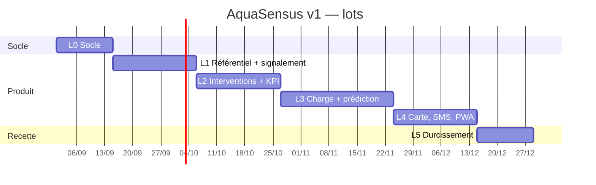

# AquaSensus — Planification

| Métadonnée | Valeur |
| --- | --- |
| Source | `docs/CAHIER-DES-CHARGES.md` (lots L0–L5, modules M1–M11) |
| Règle | Une issue ne crée aucune exigence nouvelle. Si le besoin n'existe pas dans le cahier des charges, on met à jour le document, on n'invente pas l'issue. |
| Statuts | `À faire` · `En cours` · `Bloqué` · `Fait` |
| Definition of Done | Celle du CDC §17.1 (tests TDD, RBAC serveur, Flyway si schéma, tokens de la charte, OpenAPI) |

Ce dossier est le **backlog d'implémentation**. Les documents de `docs/` restent la source de vérité métier. Ici on découpe le travail.

---

## Comment lire ce dossier

```
planification/
├── README.md                 ← cette vue
├── lots.md                   ← ordre des lots, jalons, dépendances
└── modules/                  ← une fiche par module, issues à l'intérieur
    ├── 00-socle.md
    ├── 01-referentiel.md
    ├── …
    └── 12-durcissement-recette.md
```

Chaque issue a un identifiant `ISS-nnn`, un lot, une priorité MoSCoW, les exigences `EF-nn` / `ENF-nn` / `RG-nn` qu'elle réalise, et des cases d'acceptation. On peut copier une issue vers GitHub sans la réécrire.

**Interdit dans toute issue :** saisie de volumes, capteurs IoT, opérateur SMS réel, KYC lourd (H-2, bible §5).

---

## Vue par lots



Les dates du diagramme sont indicatives (démarrage au 1er septembre 2026). Le CDC donne des **durées**, pas un calendrier figé.

| Lot | Durée | Modules | Jalon |
| --- | --- | --- | --- |
| **L0** Socle | 2 sem. | Socle technique | J1 — `docker compose up`, `/health`, CI verte |
| **L1** Référentiel et signalement | 3 sem. | M1, M2, M11 (base) | Créer un ouvrage, signaler, corroborer, qualifier |
| **L2** Interventions et KPI social | 3 sem. | M3, M6 (file), M9 (compléments) | J2 — boucle sociale mesurée |
| **L3** Data et prédiction | 4 sem. | M4, M5 | J3 — première alerte explicable |
| **L4** Restitution et canaux | 3 sem. | M6, M7, M8, M11 (PWA) | Carte, tableau de bord, SMS/USSD simulé |
| **L5** Durcissement et recette | 2 sem. | Transverse | J4 — v1.0 déployable |

---

## Vue par modules

| Fiche | Module | Issues | Lot principal |
| --- | --- | --- | --- |
| [00-socle.md](modules/00-socle.md) | Socle (dépôt, Docker, auth, CI) | ISS-001 → ISS-009 | L0 |
| [01-referentiel.md](modules/01-referentiel.md) | M1 Référentiel | ISS-010 → ISS-015 | L1 |
| [02-signalement.md](modules/02-signalement.md) | M2 Signalement | ISS-016 → ISS-022 | L1 |
| [03-maintenance.md](modules/03-maintenance.md) | M3 Interventions | ISS-023 → ISS-030 | L2 |
| [04-charge-usage.md](modules/04-charge-usage.md) | M4 Charge d'usage | ISS-031 → ISS-034 | L3 |
| [05-prediction.md](modules/05-prediction.md) | M5 Indice et alertes | ISS-035 → ISS-042 | L3 |
| [06-restitution.md](modules/06-restitution.md) | M6 Carte et KPI | ISS-043 → ISS-046 | L2 / L4 |
| [07-canal-sms-ussd.md](modules/07-canal-sms-ussd.md) | M7 Canal simulé | ISS-047 → ISS-051 | L4 |
| [08-notifications.md](modules/08-notifications.md) | M8 Notifications | ISS-052 → ISS-053 | L4 |
| [09-identite-admin.md](modules/09-identite-admin.md) | M9 Comptes et admin | ISS-054 → ISS-056 | L0 / L2 |
| [10-audit.md](modules/10-audit.md) | M10 Journal d'audit | ISS-057 | L2 / L5 |
| [11-hors-ligne.md](modules/11-hors-ligne.md) | M11 Hors ligne | ISS-058 → ISS-060 | L1 / L4 |
| [12-durcissement-recette.md](modules/12-durcissement-recette.md) | Qualité, sécu, recette | ISS-061 → ISS-068 | L5 |

**68 issues** au total. Must d'abord, Should si le lot tient, Could en dernier.

---

## Ordre de prise (dépendances)

1. Socle (ISS-001 à 009) — rien d'autre ne démarre sans ça.
2. Identité minimale (déjà dans le socle) puis **M1** puis **M2** : on ne signale pas un ouvrage qui n'existe pas.
3. **M11** (file locale) en parallèle de M2, dès le premier `POST /reports`.
4. **M3** dès que la qualification existe : c'est le KPI n°1.
5. File de travail délégué (ISS-046) dès L2, carte complète en L4.
6. **M4** avant **M5** : l'indicateur `M` alimente les règles.
7. **M7** après le port de messagerie utilisé par M2 (notifications graves) et M8.
8. L5 seulement quand J2 et J3 sont démontrables.

---

## Règles de tenue du backlog

| Règle | Détail |
| --- | --- |
| Une issue, une intention | Si ça ne tient pas en une phrase d'objectif, on scinde |
| Traçabilité | Toute case cochée « Fait » cite les tests et l'exigence |
| TDD | Le test d'acceptation est écrit **avant** le code (CDC §13.1) |
| Pas de logique métier dans les fronts | Les issues Angular/Flutter n'implémentent jamais une règle `RG-nn` |
| Mise à jour | Quand une exigence change, on met à jour le CDC **puis** l'issue |
